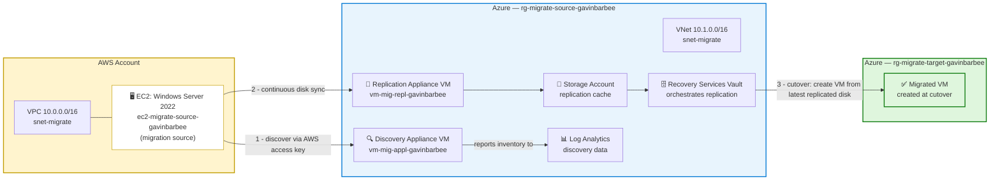

# AWS to Azure Migration: EC2 to Azure VM Using Azure Migrate

## 🎬 Watch Me Build This Lab!

*(Loom link coming soon — will be added after recording)*

---

## 📖 Project Overview

This project is an end-to-end cloud-to-cloud migration: a Windows Server running on AWS EC2 is discovered, assessed, replicated, and cut over into Azure using **Azure Migrate** — Microsoft's native migration service. This is one of the highest-value real-world cloud engineering engagements: companies move workloads between clouds for cost, compliance, consolidation, or after acquiring a business running on a different platform.

The infrastructure on both sides — the AWS source environment and the Azure target/staging environment — is provisioned with **Terraform**, split into two independent roots (`aws-side` and `azure-side`) so each cloud's resources can be destroyed independently. The migration itself (appliance registration, discovery, assessment, replication, and cutover) is portal-driven, because Azure Migrate's appliance requires interactive registration and credential entry that Terraform cannot perform.

**What "agentless" means here:** nothing is installed on the EC2 source machine itself. However, unlike VMware agentless migrations, AWS migrations still require two dedicated appliance VMs running in Azure: a **discovery appliance** (inventory and assessment) and a **replication appliance** / Configuration Server (disk-level replication via Azure Site Recovery under the hood). Both are required regardless of whether agents run on the source machine.

**Skills demonstrated:**

- Cross-cloud migration planning and execution (AWS → Azure)
- Dual Terraform root design — independently deployable/destroyable AWS and Azure stacks
- AWS networking fundamentals: VPC, subnets, internet gateway, route tables (mapped to Azure VNet equivalents)
- AWS IAM least-privilege role and policy design for a third-party discovery service
- Azure Migrate architecture: discovery appliance vs. replication appliance, and why AWS migrations require both
- Azure Site Recovery concepts underlying agentless replication (replication cache storage, Recovery Services Vault)
- Migration assessment interpretation (Azure readiness, VM right-sizing, cost estimation)
- Continuous replication monitoring and test-migration validation before cutover
- Cutover execution and post-migration verification
- Cross-cloud secrets handling (AWS IAM access keys passed into an Azure-hosted appliance)
- Multi-stage infrastructure teardown with correct dependency ordering across two clouds

---

## 🏗️ Architecture Diagram



**How it works:** The discovery appliance in Azure authenticates to AWS with a dedicated, least-privilege IAM access key and reads EC2 instance metadata — no agent runs on the EC2 instance itself. Once discovered, an assessment recommends an Azure VM size and estimates cost. Separately, the replication appliance continuously syncs disk-level changes from the EC2 instance into an Azure storage account (the replication cache), orchestrated by a Recovery Services Vault running Azure Site Recovery underneath. When replication reaches a steady "Protected" state, a test migration validates the target VM boots correctly in an isolated network — then cutover creates the final VM in the target resource group from the most recently synced disk state. The source and target resource groups are kept separate so the migration/staging infrastructure can be torn down without touching the newly migrated VM.

---

## ✅ Prerequisites

> The checklist below is what to have ready. The literal commands for IAM setup, CLI installation, and folder structure are in **Part 0** of Project Steps, not repeated here.

- [ ] An AWS account with programmatic access — [create one free](https://aws.amazon.com) if needed
- [ ] An AWS IAM user (`terraform-migrate-lab`) with `AmazonEC2FullAccess` and `AmazonVPCFullAccess`, with an Access Key ID and Secret Access Key saved
- [ ] An active Azure subscription
- [ ] Terraform installed (`brew install hashicorp/tap/terraform` on Mac, or [download for Windows](https://developer.hashicorp.com/terraform/install))
- [ ] AWS CLI installed and configured (`aws configure`, then verify with `aws sts get-caller-identity`)
- [ ] Azure CLI installed and authenticated (`az login`, then verify with `az account show`)
- [ ] Remote Desktop client available (Microsoft Remote Desktop on Mac App Store, or built-in `mstsc` on Windows)
- [ ] **Budget awareness**: this lab uses paid resources on both clouds — estimated **$5–8 total** if destroyed within one day. See cost table below.
- [ ] 4–6 hours set aside — this is a long lab with real wait times (VM boot, discovery, assessment, and especially replication, which can take 30–60+ minutes)

**Cost estimate if run and destroyed within one day:**

| Resource | Estimated Cost |
|---|---|
| EC2 t3.medium (Windows) | ~$0.08/hour (~$0.50 for 6 hours) |
| Azure Migrate discovery appliance VM (Standard_A4_v2) | ~$0.40/hour |
| Azure replication appliance VM (Standard_A4_v2) | ~$0.40/hour |
| Azure Storage (replication cache, ~30GB) | ~$0.60/day |
| Azure target VM (Standard_B2s, post-cutover) | ~$0.05/hour |
| **Total for a full-day lab** | **~$5–8** |

> ⚠️ Destroy all resources immediately after completing the lab (see 🧹 Cleanup) to stop charges — this lab runs two appliance VMs simultaneously, which adds up faster than a typical single-VM lab.

---

## 🏷️ Naming Conventions Used

| Resource | Value |
|---|---|
| AWS IAM user (Terraform) | `terraform-migrate-lab` |
| AWS VPC | `vpc-migrate-gavinbarbee` (`10.0.0.0/16`) |
| AWS subnet | `snet-migrate-gavinbarbee` (`10.0.1.0/24`) |
| AWS security group | `sg-migrate-source-gavinbarbee` *(hits a known AWS naming conflict — see Troubleshooting)* |
| AWS EC2 instance | `ec2-migrate-source-gavinbarbee` |
| AWS IAM role (discovery) | `role-azure-migrate-gavinbarbee` |
| AWS IAM service user (Migrate auth) | `svc-azure-migrate-gavinbarbee` |
| Azure source resource group | `rg-migrate-source-gavinbarbee` |
| Azure target resource group | `rg-migrate-target-gavinbarbee` |
| Azure VNet | `vnet-migrate-gavinbarbee` (`10.1.0.0/16`) |
| Azure subnet | `snet-migrate` (`10.1.1.0/24`) |
| Azure Migrate project | `migrate-project-gavinbarbee` |
| Azure storage account (replication cache) | `stmigrategavinbarbee` |
| Azure Recovery Services Vault | `rsv-migrate-gavinbarbee` |
| Azure Log Analytics workspace | `law-migrate-gavinbarbee` |
| Discovery appliance VM | `vm-mig-appl-gavinbarbee` |
| Replication appliance VM | `vm-mig-repl-gavinbarbee` |
| Terraform local root | `~/aws-to-azure-migrate/{aws-side,azure-side}` |

---

## 🪜 Project Steps

All Terraform configuration referenced below lives in this repo under [`terraform/aws-side`](terraform/aws-side) and [`terraform/azure-side`](terraform/azure-side) — copy `terraform.tfvars.example` to `terraform.tfvars` in each and fill in real values before applying. **Never commit `terraform.tfvars`** — it holds real passwords and is gitignored.

### Part 0 — Local Environment and AWS IAM Setup

#### Step 0a: Create the AWS IAM user for Terraform

In the AWS Console:

1. **IAM** → **Users** → **Create user**
2. Name it `terraform-migrate-lab`
3. Attach the `AmazonEC2FullAccess` and `AmazonVPCFullAccess` policies
4. Create access keys and save the Access Key ID and Secret Access Key — these go into `aws configure` in the next step

#### Step 0b: Install and configure the CLIs

**Mac:**
```bash
# Terraform
brew tap hashicorp/tap && brew install hashicorp/tap/terraform

# AWS CLI
brew install awscli
aws configure
# Enter: Access Key ID, Secret Access Key, region (us-east-1), output format (json)

# Azure CLI
brew install azure-cli
az login
az account set --subscription "Azure subscription 1"
```

**Windows (PowerShell):**
```powershell
# AWS CLI — download from https://aws.amazon.com/cli/
aws configure
# Enter: Access Key ID, Secret Access Key, region (us-east-1), output format (json)

# Azure CLI — download from https://aka.ms/installazurecliwindows
az login
az account set --subscription "Azure subscription 1"
```

Verify both are configured before continuing — both commands should return account info without errors:

```bash
aws sts get-caller-identity
az account show
```

#### Step 0c: Set up the local folder structure

This lab uses two independent Terraform roots so each cloud's resources can be destroyed separately.

**Mac:**
```bash
mkdir ~/aws-to-azure-migrate
cd ~/aws-to-azure-migrate
mkdir aws-side azure-side
touch aws-side/main.tf aws-side/variables.tf aws-side/outputs.tf aws-side/terraform.tfvars
touch azure-side/main.tf azure-side/variables.tf azure-side/outputs.tf azure-side/terraform.tfvars
```

**Windows (PowerShell):**
```powershell
New-Item -ItemType Directory -Path "$HOME\aws-to-azure-migrate"
cd "$HOME\aws-to-azure-migrate"
New-Item -ItemType Directory -Path aws-side, azure-side
New-Item -ItemType File aws-side\main.tf, aws-side\variables.tf, aws-side\outputs.tf, aws-side\terraform.tfvars
New-Item -ItemType File azure-side\main.tf, azure-side\variables.tf, azure-side\outputs.tf, azure-side\terraform.tfvars
```

> This repo's [`terraform/aws-side`](terraform/aws-side) and [`terraform/azure-side`](terraform/azure-side) folders already contain the finished versions of these files — copy them into your local `aws-to-azure-migrate` folders, or just work directly from this repo. Either way, remember to copy `terraform.tfvars.example` → `terraform.tfvars` and fill in real values — never commit the real file.

---

### Part 1 — Build the AWS Source Environment

#### Step 1: Write and deploy the AWS-side Terraform

The AWS side provisions the source environment: a VPC (AWS's equivalent of a VNet), a subnet with an internet gateway and route table so the Azure-hosted appliance can reach it, a security group opening HTTPS (443, for appliance communication) and RDP (3389, for admin access), an IAM role/policy granting Azure Migrate exactly the read + scoped-snapshot permissions it needs, and the EC2 Windows Server 2022 instance itself. A dedicated IAM user with an access key is also created — Azure Migrate authenticates cross-cloud with static keys rather than role assumption.

**`aws-side/variables.tf`:**

```hcl
variable "aws_region" {
  description = "AWS region to deploy the source EC2 instance into."
  type        = string
  default     = "us-east-1"
}

variable "yourname" {
  description = "Your name, lowercase, no spaces. Used to make resource names unique."
  type        = string
  default     = "gavinbarbee"
}

variable "windows_ami" {
  description = "Windows Server 2022 Base AMI ID for us-east-1. Update if using a different region."
  type        = string
  default     = "ami-0c2b0d3fb02824d92"
}

variable "instance_type" {
  description = "EC2 instance type. t3.medium is the minimum for Windows Server."
  type        = string
  default     = "t3.medium"
}

variable "admin_password" {
  description = "Administrator password for the Windows Server instance."
  type        = string
  sensitive   = true
}
```

**`aws-side/terraform.tfvars`** *(never commit this file — real values only, gitignored):*

```hcl
aws_region     = "us-east-1"
yourname       = "gavinbarbee"
admin_password = "YourSecureP@ssw0rd123!"
```

> **Password requirement:** the Windows Administrator password must be at least 12 characters and include uppercase, lowercase, numbers, and symbols — AWS will reject weak passwords.

**`aws-side/main.tf`:**

```hcl
terraform {
  required_providers {
    aws = {
      source  = "hashicorp/aws"
      version = "~> 5.0"
    }
  }
}

provider "aws" {
  region = var.aws_region
}

# --- VPC and Networking ---
# A VPC is AWS's equivalent of an Azure VNet — an isolated network boundary.
# cidr_block = "10.0.0.0/16" gives 65,536 addresses — far more than needed
# for one VM, but matches real-world VPC sizing conventions.
# enable_dns_hostnames = true lets EC2 instances get public DNS hostnames,
# which Azure Migrate needs to identify and reach the source machine.

resource "aws_vpc" "main" {
  cidr_block           = "10.0.0.0/16"
  enable_dns_hostnames = true
  enable_dns_support   = true
  tags = {
    Name    = "vpc-migrate-${var.yourname}"
    project = "azure-migrate-lab"
  }
}

# Without an internet gateway, the Azure Migrate appliance cannot reach the
# EC2 instance and the instance cannot call AWS APIs. No cost to attach one.
resource "aws_internet_gateway" "main" {
  vpc_id = aws_vpc.main.id
  tags = {
    Name = "igw-migrate-${var.yourname}"
  }
}

resource "aws_subnet" "main" {
  vpc_id                  = aws_vpc.main.id
  cidr_block              = "10.0.1.0/24"
  availability_zone       = "${var.aws_region}a"
  map_public_ip_on_launch = true
  tags = {
    Name = "snet-migrate-${var.yourname}"
  }
}

# Routes all internet-bound traffic (0.0.0.0/0) through the gateway. Without
# this rule, the subnet is private and unreachable from outside AWS.
resource "aws_route_table" "main" {
  vpc_id = aws_vpc.main.id
  route {
    cidr_block = "0.0.0.0/0"
    gateway_id = aws_internet_gateway.main.id
  }
  tags = {
    Name = "rt-migrate-${var.yourname}"
  }
}

resource "aws_route_table_association" "main" {
  subnet_id      = aws_subnet.main.id
  route_table_id = aws_route_table.main.id
}

# --- Security Group ---
# AWS's stateful firewall attached to instances — equivalent to an Azure NSG.
# Port 443 lets the Azure Migrate appliance communicate with the instance
# during replication; port 3389 (RDP) is for admin verification access.
# Opening both to 0.0.0.0/0 is acceptable for a short-lived lab only — in a
# real environment, restrict RDP to your specific IP.

resource "aws_security_group" "source_vm" {
  name        = "sg-migrate-source-${var.yourname}"
  description = "Allow HTTPS and RDP for Azure Migrate lab"
  vpc_id      = aws_vpc.main.id

  ingress {
    description = "HTTPS for Azure Migrate appliance communication"
    from_port   = 443
    to_port     = 443
    protocol    = "tcp"
    cidr_blocks = ["0.0.0.0/0"]
  }

  ingress {
    description = "RDP for admin access"
    from_port   = 3389
    to_port     = 3389
    protocol    = "tcp"
    cidr_blocks = ["0.0.0.0/0"]
  }

  egress {
    description = "Allow all outbound"
    from_port   = 0
    to_port     = 0
    protocol    = "-1"
    cidr_blocks = ["0.0.0.0/0"]
  }

  tags = {
    Name = "sg-migrate-source-${var.yourname}"
  }
}

# --- IAM Role for Azure Migrate Discovery ---
# Defines exactly what Azure Migrate can do in this account — read-only EC2
# metadata plus scoped snapshot create/delete for agentless disk replication.
# ec2:CreateSnapshot / DeleteSnapshot are write ops, but scoped to snapshot
# resources only — Migrate creates a temp snapshot, copies data, then deletes it.

data "aws_iam_policy_document" "assume_role" {
  statement {
    effect = "Allow"
    principals {
      type        = "Service"
      identifiers = ["ec2.amazonaws.com"]
    }
    actions = ["sts:AssumeRole"]
  }
}

data "aws_iam_policy_document" "migrate_permissions" {
  statement {
    effect = "Allow"
    actions = [
      "ec2:DescribeInstances",
      "ec2:DescribeInstanceTypes",
      "ec2:DescribeVolumes",
      "ec2:DescribeSnapshots",
      "ec2:DescribeImages",
      "ec2:DescribeRegions",
      "ec2:CreateSnapshot",
      "ec2:DeleteSnapshot",
      "ec2:DescribeTags"
    ]
    resources = ["*"]
  }
}

resource "aws_iam_role" "migrate_role" {
  name               = "role-azure-migrate-${var.yourname}"
  assume_role_policy = data.aws_iam_policy_document.assume_role.json
  tags = {
    project = "azure-migrate-lab"
  }
}

resource "aws_iam_policy" "migrate_policy" {
  name   = "policy-azure-migrate-${var.yourname}"
  policy = data.aws_iam_policy_document.migrate_permissions.json
}

resource "aws_iam_role_policy_attachment" "migrate_attach" {
  role       = aws_iam_role.migrate_role.name
  policy_arn = aws_iam_policy.migrate_policy.arn
}

resource "aws_iam_instance_profile" "migrate_profile" {
  name = "profile-azure-migrate-${var.yourname}"
  role = aws_iam_role.migrate_role.name
}

# --- EC2 Windows Server Instance (the migration source machine) ---
# instance_type = "t3.medium" gives 2 vCPU / 4GB RAM — the practical minimum
# for Windows Server to run without being unusably slow.
# user_data sets the Administrator password on first boot — without this
# you'd need to decrypt the password via the EC2 key pair, adding
# unnecessary complexity to a migration lab.

resource "aws_instance" "source_vm" {
  ami                    = var.windows_ami
  instance_type          = var.instance_type
  subnet_id              = aws_subnet.main.id
  vpc_security_group_ids = [aws_security_group.source_vm.id]
  iam_instance_profile   = aws_iam_instance_profile.migrate_profile.name

  root_block_device {
    volume_type = "gp3"
    volume_size = 30
    encrypted   = false
  }

  user_data = <<-EOF
    <powershell>
    net user Administrator "${var.admin_password}"
    </powershell>
  EOF

  volume_tags = {
    Name    = "vol-migrate-source-${var.yourname}"
    project = "azure-migrate-lab"
  }

  tags = {
    Name    = "ec2-migrate-source-${var.yourname}"
    project = "azure-migrate-lab"
  }
}

# --- IAM Access Key for Azure Migrate (cross-cloud auth) ---
# Azure Migrate cannot assume an AWS role across clouds — it authenticates
# with a static access key/secret. This creates a dedicated, least-privilege
# IAM user for that purpose. These keys get pasted into the appliance
# configuration manager in Part 3.

resource "aws_iam_user" "migrate_user" {
  name = "svc-azure-migrate-${var.yourname}"
  tags = {
    project = "azure-migrate-lab"
  }
}

resource "aws_iam_user_policy_attachment" "migrate_user_policy" {
  user       = aws_iam_user.migrate_user.name
  policy_arn = aws_iam_policy.migrate_policy.arn
}

resource "aws_iam_access_key" "migrate_user_key" {
  user = aws_iam_user.migrate_user.name
}
```

**`aws-side/outputs.tf`:**

```hcl
output "ec2_instance_id" {
  description = "AWS instance ID — needed when configuring Azure Migrate discovery."
  value       = aws_instance.source_vm.id
}

output "ec2_public_ip" {
  description = "Public IP of the source EC2 instance — use this to connect via RDP."
  value       = aws_instance.source_vm.public_ip
}

output "ec2_private_ip" {
  description = "Private IP of the source EC2 instance."
  value       = aws_instance.source_vm.private_ip
}

output "migrate_access_key_id" {
  description = "AWS access key ID for the Azure Migrate service account. Paste into appliance config."
  value       = aws_iam_access_key.migrate_user_key.id
}

output "migrate_secret_access_key" {
  description = "AWS secret access key for the Azure Migrate service account."
  value       = aws_iam_access_key.migrate_user_key.secret
  sensitive   = true
}

output "aws_region" {
  value = var.aws_region
}
```

**Deploy:**

```bash
cd terraform/aws-side
terraform init
terraform plan
terraform apply
```

Expect **10 resources** to add. Deployment takes 3–5 minutes — Windows instances take longer to initialize than Linux, so wait an additional 5 minutes after `apply` completes before attempting RDP.

Save these outputs — they're needed in Part 3:

```bash
terraform output ec2_public_ip
terraform output ec2_instance_id
terraform output migrate_access_key_id
terraform output -raw migrate_secret_access_key
```


#### Step 2: Verify the EC2 instance via RDP

Confirm the source machine is actually up before proceeding to the Azure side.

**Mac:** Open Microsoft Remote Desktop → Add PC → PC name: the `ec2_public_ip` output, Username: `Administrator`, Password: the value from `terraform.tfvars`.

**Windows (PowerShell):**
```powershell
$ip = terraform output -raw ec2_public_ip
mstsc /v:$ip
```

You should see a standard Windows Server desktop — this confirms the source machine is ready for migration.


---

### Part 2 — Build the Azure Target Environment

#### Step 3: Write and deploy the Azure-side Terraform (base resources)

The Azure side provisions the staging/source resource group and VNet (`10.1.0.0/16` — deliberately non-overlapping with the AWS VPC), a separate target resource group for the post-cutover VM, a storage account for the replication cache, a Log Analytics workspace for discovery data, a Recovery Services Vault (which orchestrates replication via Azure Site Recovery under the hood), and an NSG for the eventual migrated VM.

**`azure-side/variables.tf`** *(base version — two more variables are added in Steps 5 and 9):*

```hcl
variable "yourname" {
  type = string
}

variable "location" {
  description = "Azure region for target resources. Choose a region close to your AWS region."
  type        = string
  default     = "East US"
}

variable "tags" {
  type = map(string)
  default = {
    project    = "azure-migrate-lab"
    managed_by = "terraform"
  }
}
```

**`azure-side/terraform.tfvars`** *(never commit this file):*

```hcl
yourname = "gavinbarbee"
location = "East US"
```

**`azure-side/main.tf`** *(base version — appliance and replication VM resources are appended in Steps 5 and 9):*

```hcl
terraform {
  required_providers {
    azurerm = {
      source  = "hashicorp/azurerm"
      version = "~> 3.0"
    }
  }
}

provider "azurerm" {
  features {}
}

data "azurerm_client_config" "current" {}

# --- Source Resource Group and Networking ---
# "Source" is from Azure's perspective — this RG is the staging area where
# the appliances and cache storage live during migration. 10.1.0.0/16 is
# deliberately different from the AWS VPC (10.0.0.0/16) to avoid address
# overlap if VPN/peering is added later.

resource "azurerm_resource_group" "source" {
  name     = "rg-migrate-source-${var.yourname}"
  location = var.location
  tags     = var.tags
}

resource "azurerm_virtual_network" "main" {
  name                = "vnet-migrate-${var.yourname}"
  location            = var.location
  resource_group_name = azurerm_resource_group.source.name
  address_space       = ["10.1.0.0/16"]
  tags                = var.tags
}

resource "azurerm_subnet" "main" {
  name                 = "snet-migrate"
  resource_group_name  = azurerm_resource_group.source.name
  virtual_network_name = azurerm_virtual_network.main.name
  address_prefixes     = ["10.1.1.0/24"]
}

# --- Target Resource Group ---
# Kept separate from the source/staging RG so migration infrastructure can
# be destroyed after cutover without touching the newly migrated VM.

resource "azurerm_resource_group" "target" {
  name     = "rg-migrate-target-${var.yourname}"
  location = var.location
  tags     = var.tags
}

# --- Azure Migrate Project (manual step placeholder) ---
# azurerm_migrate_project is NOT supported by the AzureRM Terraform
# provider. Create the project manually in the portal after `terraform
# apply` (see Step 4): resource group rg-migrate-source-${var.yourname},
# project name migrate-project-${var.yourname}, geography United States.
# This null_resource only anchors the dependency chain — it creates
# nothing in Azure.

resource "null_resource" "migrate_project_reminder" {
  triggers = {
    resource_group = azurerm_resource_group.source.name
  }
}

# --- Storage Account (replication cache) ---
# Temporary staging storage for in-flight disk replication data. If lost
# mid-replication, replication simply restarts. account_tier = "Standard"
# and account_kind = "StorageV2" are required by Azure Migrate — other
# values will fail replication setup validation.

resource "azurerm_storage_account" "replication_cache" {
  name                     = "stmigrate${var.yourname}"
  resource_group_name      = azurerm_resource_group.source.name
  location                 = var.location
  account_tier             = "Standard"
  account_replication_type = "LRS"
  account_kind             = "StorageV2"
  min_tls_version          = "TLS1_2"
  tags                     = var.tags
}

# --- Log Analytics Workspace ---
# Azure Migrate stores discovery data, dependency maps, and migration
# history here. Discovered-machine properties shown in the portal are read
# from this workspace.

resource "azurerm_log_analytics_workspace" "main" {
  name                = "law-migrate-${var.yourname}"
  location            = var.location
  resource_group_name = azurerm_resource_group.source.name
  sku                 = "PerGB2018"
  retention_in_days   = 30
  tags                = var.tags
}

# --- Recovery Services Vault ---
# Agentless replication runs on Azure Site Recovery under the hood, and
# Site Recovery stores its replication config/policies/state here.
# soft_delete_enabled = false so the vault can be cleanly removed with
# `terraform destroy` — leave this enabled in production.
# cross_region_restore_enabled = false because this is a migration lab,
# not a backup scenario.

resource "azurerm_recovery_services_vault" "main" {
  name                          = "rsv-migrate-${var.yourname}"
  location                      = var.location
  resource_group_name           = azurerm_resource_group.source.name
  sku                           = "Standard"
  soft_delete_enabled           = false
  cross_region_restore_enabled  = false
  tags                          = var.tags
}

# --- NSG for the Migrated VM (attached post-cutover) ---
# Opens RDP so the migrated VM can be verified after cutover. In a real
# migration this would mirror the source environment's security group rules.

resource "azurerm_network_security_group" "target_vm" {
  name                = "nsg-migrate-target-${var.yourname}"
  location            = var.location
  resource_group_name = azurerm_resource_group.target.name

  security_rule {
    name                       = "allow-rdp"
    priority                   = 1000
    direction                  = "Inbound"
    access                     = "Allow"
    protocol                   = "Tcp"
    source_port_range          = "*"
    destination_port_range     = "3389"
    source_address_prefix      = "*"
    destination_address_prefix = "*"
  }

  tags = var.tags
}
```

**`azure-side/outputs.tf`** *(base version — two more outputs are added in Steps 5 and 9):*

```hcl
output "migrate_project_name" {
  value = "migrate-project-${var.yourname} (create manually in portal)"
}

output "source_resource_group" {
  value = azurerm_resource_group.source.name
}

output "target_resource_group" {
  value = azurerm_resource_group.target.name
}

output "replication_storage_account" {
  value = azurerm_storage_account.replication_cache.name
}

output "recovery_services_vault" {
  value = azurerm_recovery_services_vault.main.name
}

output "target_subnet_id" {
  description = "Paste this into the Azure Migrate replication settings when prompted for target subnet."
  value       = azurerm_subnet.main.id
}

output "vnet_name" {
  value = azurerm_virtual_network.main.name
}
```

**Deploy:**

```bash
cd terraform/azure-side
terraform init
terraform plan
terraform apply
```

Expect **9 resources** to add at this stage (the appliance and replication VMs are added in Steps 5 and 9). Deployment takes 3–4 minutes.


---

### Part 3 — Deploy and Configure the Azure Migrate Appliance

#### Step 4: Create the Migrate project and generate the appliance key (portal)

1. In the Azure portal, search **Azure Migrate** and open the service
2. **Servers, databases and web apps** → **Discover**
3. Under *Are your machines virtualized?* → **Yes, with another cloud provider (AWS, GCP, etc.)**
4. Under *Where do you want to migrate to?* → **Azure VM**
5. Create the project: resource group `rg-migrate-source-gavinbarbee`, project name `migrate-project-gavinbarbee`, geography **United States**
6. Name the appliance `appliance-migrate-gavinbarbee`
7. Click **Generate key** — copy and save this project key immediately (Notepad on the appliance VM desktop, or a password manager). It's needed inside the appliance configuration manager in Step 6.
8. Click **Download** to get the appliance installer (~1.5GB zip)


#### Step 5: Deploy the discovery appliance VM

The appliance must run on a Windows machine. Rather than clicking through the portal, add this to `azure-side/main.tf` — it provisions the NIC, public IP, NSG, and Windows VM in one apply.

**Add to `azure-side/variables.tf`:**

```hcl
variable "appliance_admin_password" {
  description = "Admin password for the appliance VM."
  type        = string
  sensitive   = true
}
```

**Add to `azure-side/main.tf`:**

```hcl
resource "azurerm_public_ip" "appliance" {
  name                = "pip-migrate-appliance-${var.yourname}"
  location            = var.location
  resource_group_name = azurerm_resource_group.source.name
  allocation_method   = "Static"
  sku                 = "Standard"
  tags                = var.tags
}

resource "azurerm_network_interface" "appliance" {
  name                = "nic-migrate-appliance-${var.yourname}"
  location            = var.location
  resource_group_name = azurerm_resource_group.source.name

  ip_configuration {
    name                          = "internal"
    subnet_id                     = azurerm_subnet.main.id
    private_ip_address_allocation = "Dynamic"
    public_ip_address_id          = azurerm_public_ip.appliance.id
  }

  tags = var.tags
}

resource "azurerm_network_security_group" "appliance" {
  name                = "nsg-migrate-appliance-${var.yourname}"
  location            = var.location
  resource_group_name = azurerm_resource_group.source.name

  security_rule {
    name                       = "allow-rdp"
    priority                   = 1000
    direction                  = "Inbound"
    access                     = "Allow"
    protocol                   = "Tcp"
    source_port_range          = "*"
    destination_port_range     = "3389"
    source_address_prefix      = "*"
    destination_address_prefix = "*"
  }

  tags = var.tags
}

resource "azurerm_network_interface_security_group_association" "appliance" {
  network_interface_id      = azurerm_network_interface.appliance.id
  network_security_group_id = azurerm_network_security_group.appliance.id
}

resource "azurerm_windows_virtual_machine" "appliance" {
  name                   = "vm-mig-appl-${var.yourname}"
  location               = var.location
  resource_group_name    = azurerm_resource_group.source.name
  size                   = "Standard_A4_v2"
  admin_username         = "migrateadmin"
  admin_password         = var.appliance_admin_password
  network_interface_ids  = [azurerm_network_interface.appliance.id]

  os_disk {
    caching              = "ReadWrite"
    storage_account_type = "Standard_LRS"
    disk_size_gb         = 80
  }

  source_image_reference {
    publisher = "MicrosoftWindowsServer"
    offer     = "WindowsServer"
    sku       = "2022-Datacenter"
    version   = "latest"
  }

  tags = var.tags
}
```

> **Why `Standard_A4_v2`?** The Azure Migrate appliance requires at least 4 vCPUs and 8GB RAM to run reliably. A4_v2 meets that and is one of the most cost-effective options for this workload (~$0.40/hour).

**Add to `azure-side/terraform.tfvars`:**

```hcl
appliance_admin_password = "YourAppliancePassword123!"
```

**Deploy:**

```bash
terraform plan
terraform apply
```

Wait ~3 minutes for the VM to boot, then get its public IP:

**Mac:**
```bash
az vm show \
  --resource-group rg-migrate-source-gavinbarbee \
  --name vm-migrate-appliance \
  --show-details \
  --query publicIps -o tsv
```

**Windows (PowerShell):**
```powershell
az vm show `
  --resource-group rg-migrate-source-gavinbarbee `
  --name vm-migrate-appliance `
  --show-details `
  --query publicIps -o tsv
```

#### Step 6: Install and register the appliance

1. RDP into the appliance VM: `terraform output appliance_public_ip`, username `migrateadmin`, password from `appliance_admin_password` in `terraform.tfvars`
2. Inside the RDP session, download (or re-download from the portal) the installer from Step 4, then **extract the zip first** — don't run files from inside it
3. Right-click `AzureMigrateInstaller.ps1` → **Run with PowerShell** as Administrator
4. Answer the prompts:

   | Prompt | Answer |
   |---|---|
   | Change execution policy? | **Y** |
   | Select scenario | **3** — Physical or other (AWS, GCP, Xen, etc.) |
   | Select cloud | **1** — Azure Public |
   | Select connectivity | **1** — Public endpoint (default) |
   | Continue with deployment? | **Y** |

5. Install takes 2–3 minutes, then a browser opens automatically with the configuration manager
6. Appliance type: **Azure Migrate: Discovery and assessment** → Cloud type: **AWS** → accept license (5–10 min)
7. In the configuration manager: **Set up prerequisites** (checks connectivity/time sync — should all pass)
8. Under **Register with Azure Migrate**, paste the project key from Step 4 → **Login** with your Azure account
9. Confirm you see **Successfully registered**


#### Step 7: Add credentials and start discovery

Still inside the appliance configuration manager, add **two** credential sets (both required):

**Credential 1 — AWS IAM service account:**
- Source type: `Windows Server` (no AWS-specific type exists in this tool)
- Friendly name: `awsmigratesvc` (letters/digits only, no hyphens)
- Username: `terraform output migrate_access_key_id` (from the AWS side)
- Password: `terraform output -raw migrate_secret_access_key`

**Credential 2 — Windows Administrator (for WinRM OS discovery):**
- Source type: `Windows Server`
- Friendly name: `ec2winadmin`
- Username: `Administrator`
- Password: the `admin_password` from `aws-side/terraform.tfvars`

Then:
1. Turn the **HTTPS slider off** (allows WinRM HTTP/5985 fallback)
2. **Add discovery source** → enter the EC2 instance's **public** IP (no VPN exists between AWS and Azure, so the private IP is unreachable) → map credentials to `ec2winadmin`
3. **Save** → **Revalidate** → wait for **Validation successful**
4. Click **Start discovery**

Discovery takes 5–15 minutes as the appliance queries the AWS EC2 API and reports results to the Migrate project.


---

### Part 4 — Assess the EC2 Instance

#### Step 8: Create and review the assessment

Assessment is where Azure Migrate evaluates the source machine and recommends sizing, cost, and compatibility — run before replication.

1. Azure Migrate → your project → **Assess** (under Migration and modernization)
2. Assessment type: **Azure VM**
3. Review settings: Target location **East US**, Storage type **Automatic**, Sizing criteria **Performance-based** (uses real CPU/memory data from the appliance), Reserved instances **None**
4. **Select machines to assess** → **Create new** group `aws-ec2-group` → check `ec2-migrate-source-gavinbarbee`
5. **Review + create assessment** → **Create assessment** (2–5 minutes)
6. Open the completed assessment and review:
   - **Azure readiness**: should show **Ready for Azure**
   - **Recommended VM size**: right-sized from actual EC2 utilization (commonly `Standard_B2s` for a lightly loaded `t3.medium`)
   - **Monthly cost estimate**

> **What "Ready for Azure" means:** Azure Migrate has checked OS version, boot type, disk count, and network configuration and found no blockers. A status of "Ready with conditions" or "Not ready" would flag specific issues to resolve before migrating — in real migration projects, this is often the single most valuable output of the assessment phase.

> **Skip "Create wave."** Wave planning batches dozens/hundreds of servers for coordinated enterprise migrations — unnecessary complexity for a single-server lab. Go straight to Part 5.


---

### Part 5 — Set Up Replication

#### Step 9: Deploy the replication appliance VM

The replication appliance (Configuration Server) is distinct from the discovery appliance and must run on its own dedicated **Windows Server 2022** VM (2019 fails during installation).

**Add to `azure-side/variables.tf`:**

```hcl
variable "replication_admin_password" {
  description = "Admin password for the replication appliance VM."
  type        = string
  sensitive   = true
}
```

**Add to `azure-side/main.tf`:**

```hcl
resource "azurerm_public_ip" "replication" {
  name                = "pip-migrate-repl-${var.yourname}"
  location            = var.location
  resource_group_name = azurerm_resource_group.source.name
  allocation_method   = "Static"
  sku                 = "Standard"
  tags                = var.tags
}

resource "azurerm_network_interface" "replication" {
  name                = "nic-migrate-repl-${var.yourname}"
  location            = var.location
  resource_group_name = azurerm_resource_group.source.name

  ip_configuration {
    name                          = "internal"
    subnet_id                     = azurerm_subnet.main.id
    private_ip_address_allocation = "Dynamic"
    public_ip_address_id          = azurerm_public_ip.replication.id
  }

  tags = var.tags
}

resource "azurerm_network_security_group" "replication" {
  name                = "nsg-migrate-repl-${var.yourname}"
  location            = var.location
  resource_group_name = azurerm_resource_group.source.name

  security_rule {
    name                       = "allow-rdp"
    priority                   = 1000
    direction                  = "Inbound"
    access                     = "Allow"
    protocol                   = "Tcp"
    source_port_range          = "*"
    destination_port_range     = "3389"
    source_address_prefix      = "*"
    destination_address_prefix = "*"
  }

  security_rule {
    name                       = "allow-https-inbound"
    priority                   = 1010
    direction                  = "Inbound"
    access                     = "Allow"
    protocol                   = "Tcp"
    source_port_range          = "*"
    destination_port_range     = "443"
    source_address_prefix      = "*"
    destination_address_prefix = "*"
  }

  tags = var.tags
}

resource "azurerm_network_interface_security_group_association" "replication" {
  network_interface_id      = azurerm_network_interface.replication.id
  network_security_group_id = azurerm_network_security_group.replication.id
}

resource "azurerm_windows_virtual_machine" "replication" {
  name                   = "vm-mig-repl-${var.yourname}"
  computer_name          = "repl-${var.yourname}"
  location               = var.location
  resource_group_name    = azurerm_resource_group.source.name
  size                   = "Standard_A4_v2"
  admin_username         = "replicationadmin"
  admin_password         = var.replication_admin_password
  network_interface_ids  = [azurerm_network_interface.replication.id]

  os_disk {
    caching              = "ReadWrite"
    storage_account_type = "Standard_LRS"
    disk_size_gb         = 127
  }

  source_image_reference {
    publisher = "MicrosoftWindowsServer"
    offer     = "WindowsServer"
    sku       = "2022-Datacenter" # Must be 2022 — installer fails on 2019
    version   = "latest"
  }

  tags = var.tags
}
```

**Add to `azure-side/terraform.tfvars`:**

```hcl
replication_admin_password = "YourPassword123!"
```

**Add to `azure-side/outputs.tf`:**

```hcl
output "replication_appliance_public_ip" {
  description = "Public IP of the replication appliance VM"
  value       = azurerm_public_ip.replication.ip_address
}
```

**Deploy:**

```bash
terraform plan
terraform apply
```

```bash
terraform output replication_appliance_public_ip
```

#### Step 10: Install and register the replication appliance

1. RDP into the replication VM: IP from `replication_appliance_public_ip`, username `replicationadmin`, password from `replication_admin_password` in `terraform.tfvars`
2. In the portal (inside the RDP session), open the classic Azure Migrate experience → **Migration and modernization** → **Discover** → select **Azure VM**, **Physical or other**, target region **East US** → **Create resources**
3. Download the replication appliance installer, extract the zip, and run `DRInstaller.ps1` as Administrator
4. In the browser-based configuration manager that opens, register the appliance with `rsv-migrate-gavinbarbee` and your subscription
5. Once registered, the appliance appears in the **On-premises appliance** dropdown when you click Replicate

#### Step 11: Enable replication

1. **Migration and modernization** → **Replicate**
2. *Are your machines virtualized?* → **Yes, with another cloud provider (AWS, GCP, etc.)**
3. On-premises appliance: `appliance-migrate-gavinbarbee` → **Next: Virtual machines**
4. Select the EC2 instance → **Next: Target settings**
5. Target settings: Resource group `rg-migrate-target-gavinbarbee`, storage account `stmigrategavinbarbee`, VNet `vnet-migrate-gavinbarbee`, subnet `snet-migrate`
6. **Next: Compute** → review/accept recommended VM size, OS type **Windows**
7. **Next: Disks** → accept defaults → **Next: Tags** → add `project = azure-migrate-lab`
8. Click **Replicate**

Initial replication (the first full disk copy) takes **20–60 minutes** depending on disk size and network conditions — a 30GB Windows disk typically takes 30–45 minutes.

#### Step 12: Monitor replication progress

**Migration and modernization** → **Replicating machines**. Wait until status moves from *Initial replication in progress* to **Protected** before proceeding to cutover. Click the machine for detailed progress: percentage synced, data uploaded, and any warnings.


---

### Part 6 — Test Migration and Cutover

#### Step 13: Run a test migration (recommended)

A test migration creates a temporary copy of the target VM in an isolated network so you can verify it boots and operates correctly **before** committing to cutover. Skipping this on a real migration is high risk.

1. Replicating machines list → click the EC2 instance → **Test migration**
2. Select VNet `vnet-migrate-gavinbarbee` → **Test migration** (5–10 minutes)
3. RDP into the resulting test VM using its public IP and the original `admin_password` from `aws-side/terraform.tfvars`
4. Verify the desktop loads and system info matches the source
5. **Clean up test migration** when done — this deletes the test VM


#### Step 14: Perform the cutover

1. Replicating machines list → click the EC2 instance → **Migrate**
2. *Shut down machines before migration?* → **No** for this lab (in production, shut down the source first to prevent split-brain writes)
3. Click **Migrate**

Azure finalizes replication, creates the target VM from the latest synced disk, and marks the machine as migrated (5–10 minutes).

#### Step 15: Verify the migrated VM

1. Navigate to `rg-migrate-target-gavinbarbee` — a new VM should be present
2. Attach a public IP so you can reach it:

```bash
az network public-ip create \
  --resource-group rg-migrate-target-gavinbarbee \
  --name pip-migrated-vm \
  --sku Standard

az network nic ip-config update \
  --resource-group rg-migrate-target-gavinbarbee \
  --nic-name $(az network nic list --resource-group rg-migrate-target-gavinbarbee --query "[0].name" -o tsv) \
  --name ipconfig1 \
  --public-ip-address pip-migrated-vm

az network public-ip show \
  --resource-group rg-migrate-target-gavinbarbee \
  --name pip-migrated-vm \
  --query ipAddress -o tsv
```

3. RDP in with the returned IP, username `Administrator`, and the original `admin_password`
4. Verify: desktop loads, hostname matches the original EC2 instance, OS version is correct

**The migration is complete** — a workload that started on AWS EC2 is now running as a native Azure VM.


---

## 🛠️ Troubleshooting

| Issue | Cause | Resolution |
|---|---|---|
| `terraform apply` fails: *"invalid value for name (cannot begin with sg-)"* | AWS reserves the `sg-` prefix for system-generated security group IDs — a user-defined `name` cannot start with it. This lab's own Terraform hits this by design. | In `aws_security_group.source_vm`, rename the `name` field from `sg-migrate-source-${var.yourname}` to `migrate-source-sg-${var.yourname}`, then re-apply. |
| `terraform apply` fails: *"collecting instance settings: empty result"* | The `windows_ami` default in `terraform.tfvars` is stale or invalid for your region. | Run: `aws ec2 describe-images --region us-east-1 --owners amazon --filters "Name=name,Values=Windows_Server-2022-English-Full-Base-*" "Name=state,Values=available" --query "sort_by(Images, &CreationDate)[-1].ImageId" --output text` and update `windows_ami`. |
| `terraform apply` fails on `azurerm_migrate_project` / provider doesn't support this resource type | The AzureRM provider has no resource type for Azure Migrate projects. | Already handled in this repo's `main.tf` via a `null_resource` placeholder — create the project manually in the portal per Step 4. |
| EC2 instance not discovered | AWS credentials entered incorrectly in the appliance | Re-enter the access key and secret in the appliance configuration manager |
| Discovery shows 0 machines | Region mismatch | Verify the region entered in the appliance matches where the EC2 instance actually runs |
| Replication stuck at 0% | Storage account not accessible | Confirm `stmigrategavinbarbee` is in the same subscription/region as the Migrate project |
| Assessment shows "Not ready" | Unsupported Windows Server version | AMI must be Windows Server 2012 R2 or later — 2022 should always pass |
| RDP to migrated VM fails | NSG not attached to the migrated VM's NIC | Attach `nsg-migrate-target-gavinbarbee` to the VM's network interface in the portal |
| Cutover VM has a different IP than expected | DHCP assigns a new Azure IP on migration | Expected behavior — update any DNS records accordingly |
| `terraform destroy` fails on the Recovery Services Vault: *"vault is not empty"* | Backup/replication items still registered in the vault | Portal → Recovery Services Vault → Backup items and Replication items → delete all manually, then retry `terraform destroy` |

---

## 🧹 Cleanup

Destroy in this exact order to avoid dependency errors across the two clouds:

1. **Stop replication first** (if still active): Azure Migrate → Replicating machines → select the machine → **Stop replication** → wait for confirmation
2. **Destroy AWS resources:**
   ```bash
   cd terraform/aws-side
   terraform destroy
   ```
3. **Delete the appliance VM** (created via CLI, not tracked by Terraform):

   **Mac:**
   ```bash
   az vm delete \
     --resource-group rg-migrate-source-gavinbarbee \
     --name vm-migrate-appliance \
     --yes

   az network nic delete --resource-group rg-migrate-source-gavinbarbee --name vm-migrate-applianceVMNic
   az network public-ip delete --resource-group rg-migrate-source-gavinbarbee --name vm-migrate-appliancePublicIP
   ```

   **Windows (PowerShell):**
   ```powershell
   az vm delete `
     --resource-group rg-migrate-source-gavinbarbee `
     --name vm-migrate-appliance `
     --yes
   ```

4. **Destroy Azure resources:**
   ```bash
   cd terraform/azure-side
   terraform destroy
   ```
   If this fails on the Recovery Services Vault, see Troubleshooting above.

5. **Delete the target resource group** (contains the migrated VM, not tracked by Terraform):
   ```bash
   az group delete --name rg-migrate-target-gavinbarbee --yes
   ```
6. Verify in both consoles that no resources remain, and double-check the AWS Billing dashboard and Azure Cost Management for any lingering charges.

---

## 💡 Key Takeaways

- **A full migration is four distinct phases, not one action** — discovery, assessment, replication, and cutover are each a separate decision point, and understanding *why* they're separate (validate before you commit, replicate before you cut) is what separates real migration experience from just clicking "migrate."
- **"Agentless" describes the source machine, not the whole migration** — AWS-to-Azure migrations still require two dedicated appliance VMs in Azure (discovery and replication) even though nothing installs on the EC2 instance itself.
- **Test migration before cutover is not optional in practice** — it's the only way to validate the target VM actually boots correctly before you commit to the real thing.
- **Two independent Terraform roots is a deliberate design choice**, not an accident — it lets you destroy AWS and Azure resources on separate timelines and avoids a single state file spanning two providers.
- **Least-privilege IAM matters even for a lab** — the AWS IAM policy for Azure Migrate grants exactly the read operations and scoped snapshot create/delete it needs, nothing more.
- **Not every error is a mistake to avoid — some are worth understanding.** This lab's own Terraform hits a real AWS naming-convention error (the `sg-` prefix conflict) that's genuinely useful to have debugged once.
- **Cross-cloud migrations always change the IP address** — DNS and any hardcoded references need to be part of the migration plan, not an afterthought discovered at cutover.

---

**Author:** Gavin Barbee
**Lab Reference:** AWS EC2 to Azure Migration Using Azure Migrate
**Difficulty:** Intermediate | **Time to Complete:** ~4–6 hours
