# AWS to Azure Migration: EC2 to Azure VM Using Azure Migrate

## 🎬 Watch Me Build This Lab!

*(Loom link coming soon — will be added after recording)*

---

## 📖 Project Overview

This project is an end-to-end cloud-to-cloud migration: a Windows Server running on AWS EC2 is discovered, assessed, and prepared for replication into Azure using **Azure Migrate** — Microsoft's native migration service. This is one of the highest-value real-world cloud engineering engagements: companies move workloads between clouds for cost, compliance, consolidation, or after acquiring a business running on a different platform.

The infrastructure on both sides — the AWS source environment and the Azure target/staging environment — is provisioned with **Terraform**, split into two independent roots (`aws-side` and `azure-side`) so each cloud's resources can be destroyed independently. The migration itself (appliance registration, discovery, assessment, and replication setup) is portal-driven, because Azure Migrate's appliances require interactive registration and credential entry that Terraform cannot perform.

**What "agentless" means here:** nothing is installed on the EC2 source machine itself for discovery. However, unlike VMware agentless migrations, AWS migrations still require dedicated appliance VMs running in Azure: a **discovery appliance** (inventory and assessment) and a **replication appliance** (disk-level replication via Azure Site Recovery under the hood). Both are required regardless of whether agents run on the source machine.

**An honest note on how this lab went:** Discovery and assessment completed successfully — the EC2 instance was found, evaluated, sized, and costed. Replication appliance setup, however, ran into a genuine wall: current Microsoft documentation specifies far higher hardware requirements for the replication appliance (8 physical cores, 16GB+ RAM, 600GB+ disk) than I originally planned for, and reaching a VM size that satisfied those requirements required more compute quota than my subscription allowed — a quota increase that, on my subscription type, could not be self-approved. This is a completely realistic outcome for a real migration project, and it's documented in full below, including everything it took to diagnose it. See **[How This Lab Ended](#-how-this-lab-ended)** for the full story, and the **Troubleshooting** section for every individual issue and fix along the way.

**Skills demonstrated:**

- Cross-cloud migration planning and execution (AWS → Azure)
- Dual Terraform root design — independently deployable/destroyable AWS and Azure stacks
- AWS networking fundamentals: VPC, subnets, internet gateway, route tables (mapped to Azure VNet equivalents)
- AWS IAM least-privilege role and policy design for a third-party discovery service — including diagnosing and fixing an under-scoped IAM policy mid-deployment
- Azure Migrate architecture: discovery appliance vs. replication appliance, and why AWS migrations require both
- Azure Site Recovery concepts underlying agentless replication (replication cache storage, Recovery Services Vault)
- Migration assessment interpretation (Azure readiness, VM right-sizing, cost estimation)
- Root-causing an opaque Azure AD error code (AADSTS530035) down to a tenant-level Conditional Access/Security Defaults policy, using the raw diagnostic details rather than guesswork
- Diagnosing a two-layer network block (cloud-level security group *and* guest-OS firewall scope) for WinRM connectivity
- Working through real Azure subscription quota constraints — vCPU family quotas, regional quotas, and the Free Trial vs. Pay-As-You-Go quota-approval distinction
- Recognizing and adapting to product/documentation drift — my original plan was based on an older two-appliance UI flow; the current Azure Migrate portal has been substantially reorganized since
- Cross-cloud secrets handling (AWS IAM access keys passed into an Azure-hosted appliance)
- Multi-stage infrastructure teardown with correct dependency ordering across two clouds, including handling Terraform's `prevent_deletion_if_contains_resources` safety feature against portal-created resources

---

## 🏗️ Architecture Diagram

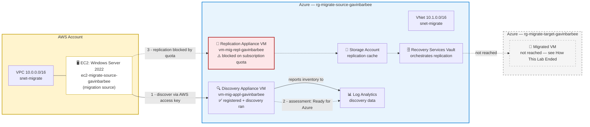
```mermaid
flowchart LR
    subgraph AWS["AWS Account"]
        VPC["VPC 10.0.0.0/16<br/>snet-migrate"]
        EC2["🖥️ EC2: Windows Server 2022<br/>ec2-migrate-source-gavinbarbee<br/>(migration source)"]
        VPC --- EC2
    end

    subgraph Source["Azure — rg-migrate-source-gavinbarbee"]
        VNet["VNet 10.1.0.0/16<br/>snet-migrate"]
        DiscApp["🔍 Discovery Appliance VM<br/>vm-mig-appl-gavinbarbee<br/>✅ registered + discovery ran"]
        ReplApp["🔁 Replication Appliance VM<br/>vm-mig-repl-gavinbarbee<br/>⚠️ blocked on subscription quota"]
        Cache["💾 Storage Account<br/>replication cache"]
        RSV["🗄️ Recovery Services Vault<br/>orchestrates replication"]
        LAW["📊 Log Analytics<br/>discovery data"]
    end

    subgraph Target["Azure — rg-migrate-target-gavinbarbee"]
        TargetVM["🚫 Migrated VM<br/>not reached — see How This Lab Ended"]
    end

    EC2 -->|"1 - discover via AWS access key"| DiscApp
    DiscApp -->|reports inventory to| LAW
    DiscApp -.->|"2 - assessment: Ready for Azure"| LAW
    EC2 -.->|"3 - replication blocked by quota"| ReplApp
    ReplApp -.-> Cache
    Cache -.-> RSV
    RSV -.->|not reached| TargetVM

    style AWS fill:#fff4ce,stroke:#c19c00,stroke-width:2px
    style Source fill:#e8f4fd,stroke:#0078d4,stroke-width:2px
    style Target fill:#f5f5f5,stroke:#999999,stroke-width:2px,stroke-dasharray: 5 5
    style TargetVM fill:#f5f5f5,stroke:#999999,stroke-width:1px,stroke-dasharray: 5 5
    style ReplApp fill:#fde7e9,stroke:#a80000,stroke-width:2px
    style EC2 fill:#ffffff,stroke:#c19c00,stroke-width:1px
```

**How it works:** The discovery appliance in Azure authenticates to AWS with a dedicated, least-privilege IAM access key and reads EC2 instance metadata — no agent runs on the EC2 instance itself. Once discovered, an assessment recommends an Azure VM size and estimates cost — both of these completed successfully. Separately, the replication appliance is meant to continuously sync disk-level changes from the EC2 instance into an Azure storage account (the replication cache), orchestrated by a Recovery Services Vault running Azure Site Recovery underneath — the appliance VM and networking for this are built by Terraform, and the appliance software installs correctly, but the VM size Microsoft's current documentation requires exceeds what this subscription's compute quota allows, so live replication, test migration, and cutover were not reached. The dashed portion of the diagram shows what a completed migration adds on top of what was actually achieved here.

---

## ✅ Prerequisites

- [ ] An AWS account with programmatic access — [create one free](https://aws.amazon.com) if needed
- [ ] An Azure subscription — **Pay-As-You-Go is strongly recommended over Free Trial.** This lab's replication appliance can require significant vCPU quota (see [How This Lab Ended](#-how-this-lab-ended)), and Azure blocks self-service quota increase requests entirely on Free Trial subscriptions. Free Trial credits still apply and burn down first after upgrading — upgrading doesn't waste them.
- [ ] Terraform installed (`brew install hashicorp/tap/terraform` on Mac, or [download for Windows](https://developer.hashicorp.com/terraform/install))
- [ ] AWS CLI installed and configured (`aws configure`, then verify with `aws sts get-caller-identity`)
- [ ] Azure CLI installed and authenticated (`az login`, then verify with `az account show`)
- [ ] Remote Desktop client available (Microsoft Remote Desktop on Mac App Store, or built-in `mstsc` on Windows)
- [ ] **Budget awareness**: this lab uses paid resources on both clouds. Small-VM stages run **$5–8/day**; if you need to size the replication appliance up to satisfy current requirements, larger VM sizes (e.g. `Standard_D16ads_v7`) run closer to **$1–1.50/hour** — still cheap for a lab you destroy same-day, but worth knowing going in.
- [ ] 6–10+ hours set aside — this lab runs considerably longer than its original estimate once you account for real Azure/AWS environment drift since it was written (stale AMIs, changed VM availability, updated appliance requirements). Budget for troubleshooting, not just following steps.

---

## 🏷️ Naming Conventions Used

| Resource | Value |
|---|---|
| AWS IAM user (Terraform) | `terraform-migrate-lab` |
| AWS VPC | `vpc-migrate-gavinbarbee` (`10.0.0.0/16`) |
| AWS subnet | `snet-migrate-gavinbarbee` (`10.0.1.0/24`) |
| AWS security group | `migrate-source-sg-gavinbarbee` *(renamed from `sg-migrate-source-gavinbarbee` — AWS reserves the `sg-` prefix)* |
| AWS EC2 instance | `ec2-migrate-source-gavinbarbee` |
| AWS IAM role (discovery) | `role-azure-migrate-gavinbarbee` |
| AWS IAM service user (Migrate auth) | `svc-azure-migrate-gavinbarbee` |
| Azure source resource group | `rg-migrate-source-gavinbarbee` |
| Azure target resource group | `rg-migrate-target-gavinbarbee` |
| Azure VNet | `vnet-migrate-gavinbarbee` (`10.1.0.0/16`) |
| Azure subnet | `snet-migrate` (`10.1.1.0/24`) |
| Azure Migrate project | `migrate-project-gavinbarbee` |
| Azure storage account (replication cache) | `stmigrategavinbarbee` |
| Azure Recovery Services Vault | `rsv-migrate-gavinbarbee` |
| Azure Log Analytics workspace | `law-migrate-gavinbarbee` |
| Discovery appliance (portal name) | `appliance-gav` *(13-character appliance-name limit)* |
| Discovery appliance VM | `vm-mig-appl-gavinbarbee`, computer name `appl-gavin` |
| Discovery appliance VM size | `Standard_D4alds_v7` *(swapped from my original planned size `Standard_A4_v2` — see Troubleshooting)* |
| Replication appliance (portal name) | `repl-gav` |
| Replication appliance VM | `vm-mig-repl-gavinbarbee`, computer name `repl-gavin` |
| Replication appliance VM size (final attempt) | `Standard_D16ads_v7` — see [How This Lab Ended](#-how-this-lab-ended) |
| Terraform local root | `~/aws-to-azure-migrate/{aws-side,azure-side}` |

---

## 🪜 Project Steps

All Terraform configuration referenced below lives in this repo under [`aws-side`](aws-side) and [`azure-side`](azure-side) — copy `terraform.tfvars.example` to `terraform.tfvars` in each and fill in real values before applying. **Never commit `terraform.tfvars`** — it holds real passwords and is gitignored.

> These steps show the **working, final configuration** — the version that actually deploys cleanly, informed by everything hit along the way. Every real error, fix, and dead end from getting here lives in the **Troubleshooting** section below, grouped by category, not mixed into these steps.

### Part 0 — Local Environment and AWS IAM Setup

#### Step 0a: Create the AWS IAM user for Terraform

In the AWS Console:

1. **IAM** → **Users** → **Create user**
2. Name it `terraform-migrate-lab`
3. Attach the `AmazonEC2FullAccess` and `AmazonVPCFullAccess` policies — **note:** you will also need to attach `IAMFullAccess` before Terraform can apply successfully; see Troubleshooting for why this wasn't obvious upfront
4. Create access keys and save the Access Key ID and Secret Access Key — these go into `aws configure` in the next step

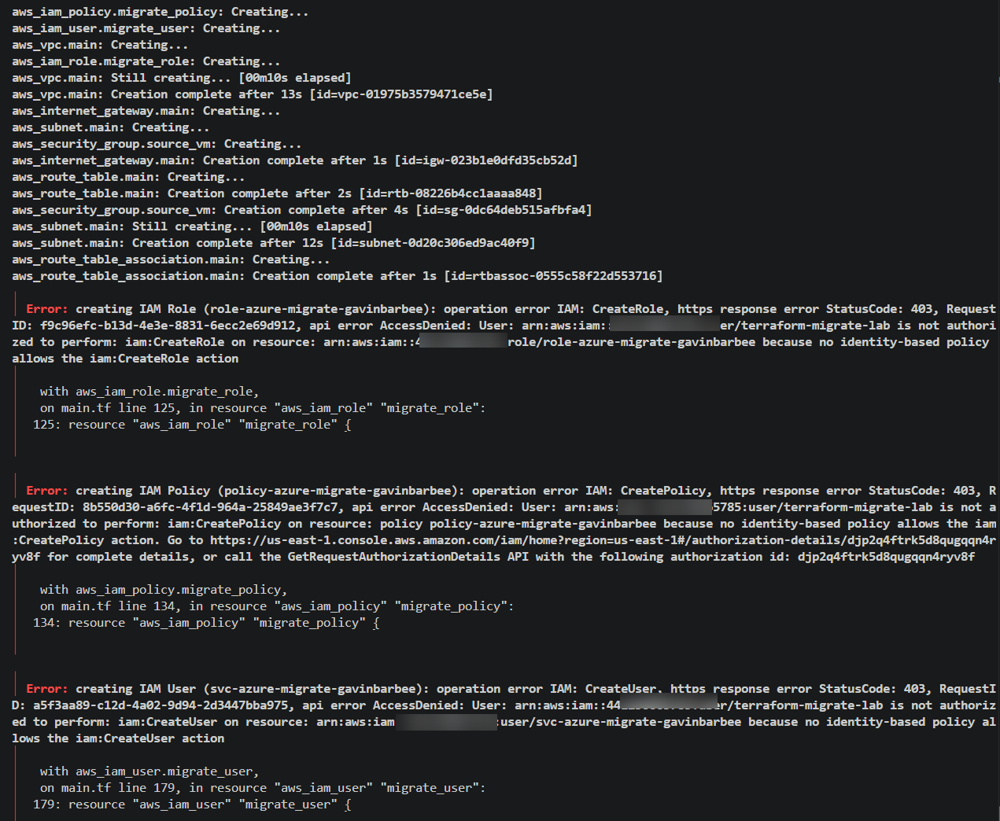
*The error you'll hit if you only attach the first two policies — Terraform can create the VPC/EC2 resources fine, but fails on every IAM resource (role, policy, user) with AccessDenied.*

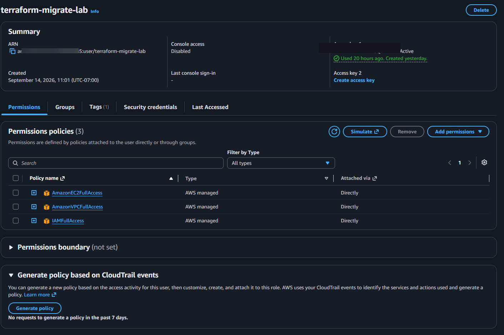
*Fixed: `IAMFullAccess` added alongside the original two policies.*

#### Step 0b: Install and configure the CLIs

**Mac:**
```bash
# Terraform
brew tap hashicorp/tap && brew install hashicorp/tap/terraform

# AWS CLI
brew install awscli
aws configure
# Enter: Access Key ID, Secret Access Key, region (us-east-1), output format (json)

# Azure CLI
brew install azure-cli
az login
az account set --subscription "Azure subscription 1"
```

**Windows (PowerShell):**
```powershell
# AWS CLI — download from https://aws.amazon.com/cli/
aws configure
# Enter: Access Key ID, Secret Access Key, region (us-east-1), output format (json)

# Azure CLI — download from https://aka.ms/installazurecliwindows
az login
az account set --subscription "Azure subscription 1"
```

Verify both are configured before continuing:

```bash
aws sts get-caller-identity
az account show
```

#### Step 0c: Set up the local folder structure

**Mac:**
```bash
mkdir ~/aws-to-azure-migrate
cd ~/aws-to-azure-migrate
mkdir aws-side azure-side
touch aws-side/main.tf aws-side/variables.tf aws-side/outputs.tf aws-side/terraform.tfvars
touch azure-side/main.tf azure-side/variables.tf azure-side/outputs.tf azure-side/terraform.tfvars
```

**Windows (PowerShell):**
```powershell
New-Item -ItemType Directory -Path "$HOME\aws-to-azure-migrate"
cd "$HOME\aws-to-azure-migrate"
New-Item -ItemType Directory -Path aws-side, azure-side
New-Item -ItemType File aws-side\main.tf, aws-side\variables.tf, aws-side\outputs.tf, aws-side\terraform.tfvars
New-Item -ItemType File azure-side\main.tf, azure-side\variables.tf, azure-side\outputs.tf, azure-side\terraform.tfvars
```

> This repo's [`aws-side`](aws-side) and [`azure-side`](azure-side) folders already contain the finished versions of these files — copy them into your local folders, or work directly from this repo. Either way, copy `terraform.tfvars.example` → `terraform.tfvars` and fill in real values — never commit the real file.

---

### Part 1 — Build the AWS Source Environment

#### Step 1: Write and deploy the AWS-side Terraform

The AWS side provisions a VPC, a subnet with an internet gateway and route table, a security group opening HTTPS (443), RDP (3389), and WinRM (5985 — needed later for discovery, see Troubleshooting), an IAM role/policy for Azure Migrate, and the EC2 Windows Server 2022 instance. A dedicated IAM user with an access key is also created for cross-cloud authentication.

**`aws-side/main.tf`** (full content in the repo) — key points:

- Security group name uses `migrate-source-sg-gavinbarbee`, **not** `sg-migrate-source-gavinbarbee` — AWS reserves the `sg-` prefix for system-generated IDs (see Troubleshooting)
- The security group includes a third ingress rule for port **5985** (WinRM HTTP), required later for the discovery appliance to reach the EC2 instance — not present in the lab's original design
- `windows_ami` in `terraform.tfvars` needs a current AMI ID looked up at deploy time (see Troubleshooting) — hardcoded AMI defaults go stale over time

**Deploy:**

```bash
cd aws-side
terraform init
terraform plan
terraform apply
```

> **Password requirement:** the Windows Administrator password in `terraform.tfvars` must be at least 12 characters and include uppercase, lowercase, numbers, and symbols — AWS will reject weak passwords.

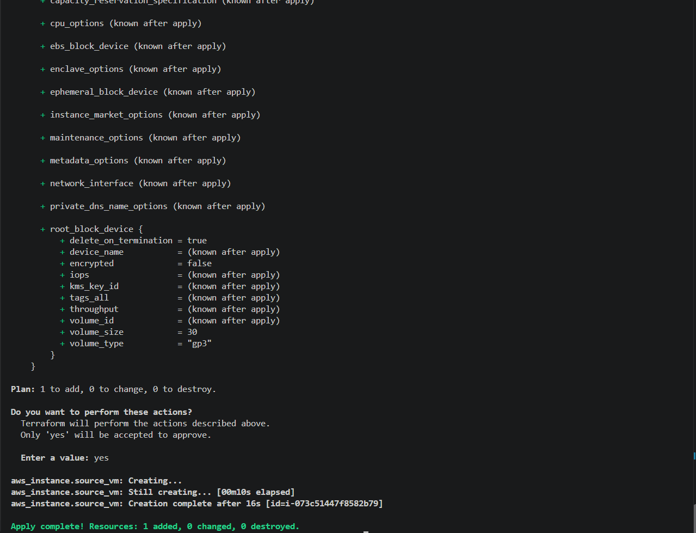

Save these outputs — needed in Part 3:

```bash
terraform output ec2_public_ip
terraform output ec2_instance_id
terraform output migrate_access_key_id
terraform output -raw migrate_secret_access_key
```

#### Step 2: Verify the EC2 instance via RDP

```powershell
$ip = terraform output -raw ec2_public_ip
mstsc /v:$ip
```
Username: `Administrator`, password: your `admin_password` from `terraform.tfvars`.

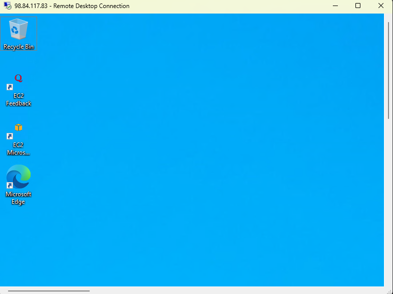

The instance details page (IAM role, VPC, subnet all linked from one view) is a useful sanity check too:

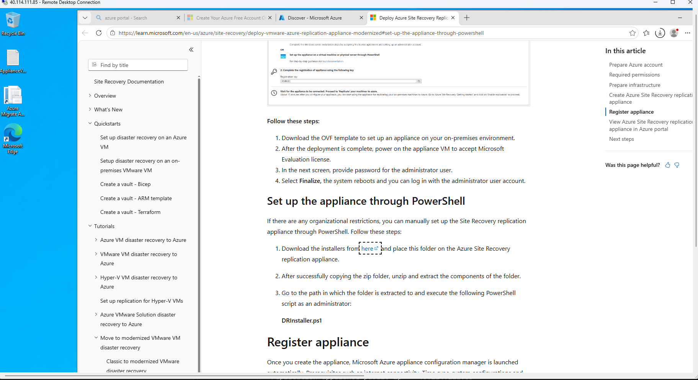

The VPC's resource map (subnet, route tables, internet gateway all connected) and the security group's final rule set (443, 3389, and the 5985/WinRM rule added later — see Networking Issues in Troubleshooting) are worth a look as well:

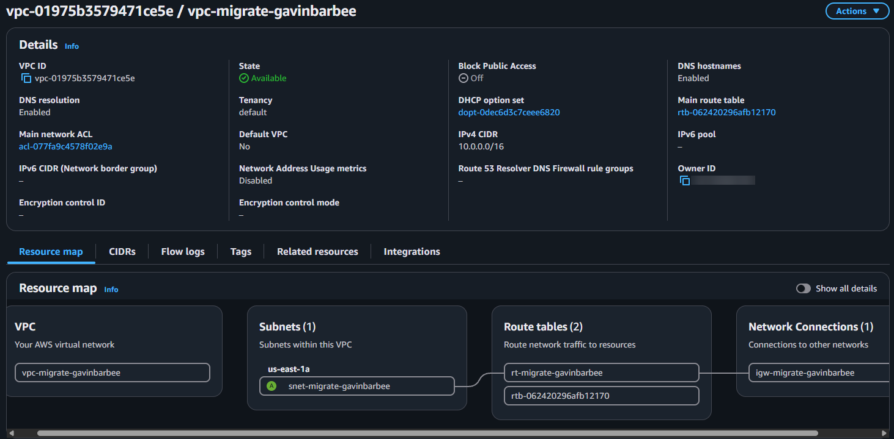
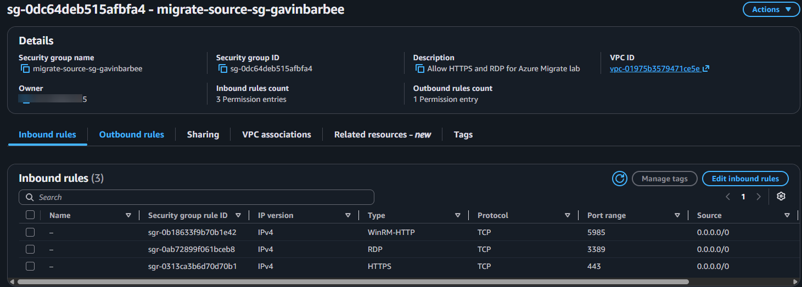

---

### Part 2 — Build the Azure Target Environment

#### Step 3: Write and deploy the Azure-side Terraform (base resources)

The Azure side provisions the source/staging resource group and VNet, a separate target resource group, a storage account for the replication cache, a Log Analytics workspace, a Recovery Services Vault, and an NSG for the eventual migrated VM.

Full code is in [`azure-side/main.tf`](azure-side/main.tf) — one setting differs from my original plan: `soft_delete_enabled = true` on the Recovery Services Vault (setting it to `false`, which I'd originally planned, is no longer accepted by Azure — see Troubleshooting).

```bash
cd azure-side
terraform init
terraform plan
terraform apply
```

Expect **9 resources** to add. Deployment takes 3–4 minutes.

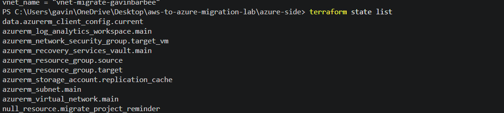

---

### Part 3 — Deploy and Configure the Discovery Appliance

#### Step 4: Create the Migrate project and generate the appliance key

1. Azure portal → search **Azure Migrate** → **Discover**
2. *Are your machines virtualized?* → **Yes, with another cloud provider (AWS, GCP, etc.)**
3. Create the project: resource group `rg-migrate-source-gavinbarbee`, project name `migrate-project-gavinbarbee`, geography **United States**
4. Name the appliance — **keep it to 13 characters or fewer** (`appliance-gav`, not `appliance-migrate-gavinbarbee` — the longer name is rejected)
5. Click **Generate key** — copy and save this key immediately, it's needed in Step 6
6. Click **Download** to get the appliance installer (~1.5GB zip)

#### Step 5: Deploy the discovery appliance VM

Add to `azure-side/main.tf` (already included in this repo): NIC, public IP, NSG, and Windows VM.

```hcl
resource "azurerm_windows_virtual_machine" "appliance" {
  name                   = "vm-mig-appl-gavinbarbee"
  computer_name          = "appl-gavin"
  location               = var.location
  resource_group_name    = azurerm_resource_group.source.name
  size                   = "Standard_D4alds_v7"
  admin_username         = "migrateadmin"
  admin_password         = var.appliance_admin_password
  network_interface_ids  = [azurerm_network_interface.appliance.id]

  os_disk {
    caching              = "ReadWrite"
    storage_account_type = "Standard_LRS"
    disk_size_gb         = 127
  }

  source_image_reference {
    publisher = "MicrosoftWindowsServer"
    offer     = "WindowsServer"
    sku       = "2022-Datacenter-g2"
    version   = "latest"
  }

  tags = var.tags
}
```

> `Standard_D4alds_v7` (not `Standard_A4_v2`, my original planned size, which is no longer available in most regions) and the `-g2` image SKU (matching this size's Generation 2 hypervisor requirement), plus `computer_name` shortened to 13 characters — all fixes for real errors documented in Troubleshooting.

```bash
terraform apply
```

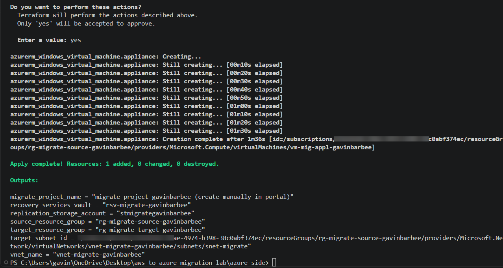

#### Step 6: Install and register the appliance

1. RDP into the appliance VM (get the IP via `az vm show ... --query publicIps` or the portal, since this VM's name doesn't match what an `appliance_public_ip` Terraform output — not defined by default — would need)
2. Download the installer, **extract first**, right-click `AzureMigrateInstaller.ps1` → Run with PowerShell as Administrator
3. Answer the four prompts: **Y** (execution policy) → **3** (Physical or other) → **1** (Azure Public) → **1** (Public endpoint)

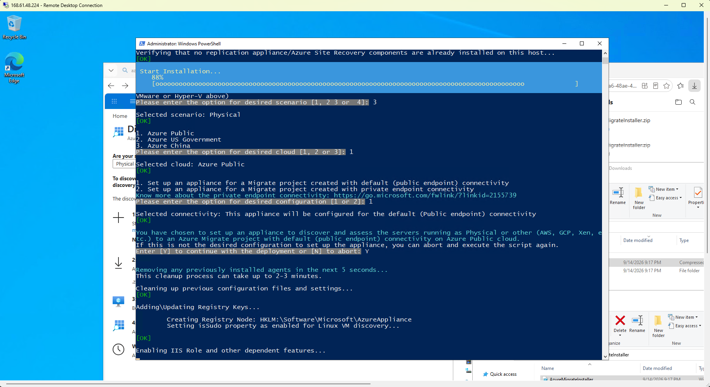

4. When prompted to remove Internet Explorer, answer **Y** — this is expected, IE's Enhanced Security Configuration would otherwise block the configuration manager
5. After reboot, the configuration manager opens automatically. Run **Set up prerequisites**, paste the project key, click **Login**

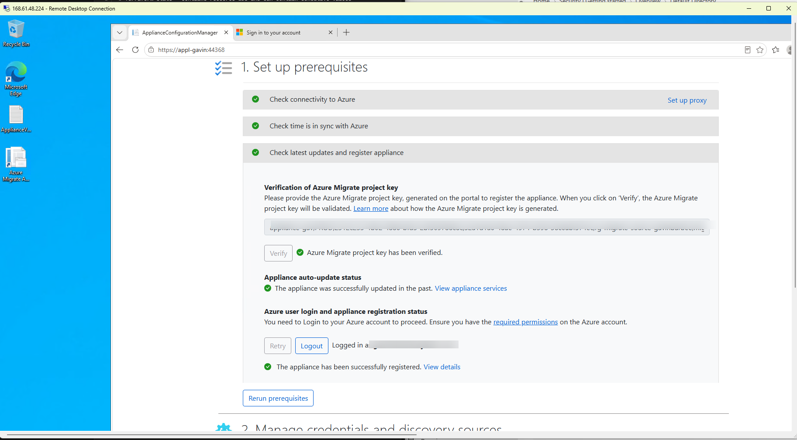

> If Microsoft sign-in fails with `AADSTS900561` or shows a Conditional Access block (error code `530035`), see the **Authentication Issues** section in Troubleshooting — this is a tenant-level Security Defaults policy, not a credentials problem.

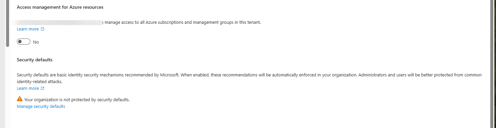

#### Step 7: Add credentials and start discovery

Add two credential sets: `awsmigratesvc` (username = `migrate_access_key_id`, password = `migrate_secret_access_key` from the AWS Terraform outputs) and `ec2winadmin` (`Administrator` / your EC2 `admin_password`).

Turn the **HTTPS slider off**, **Add discovery source** with the EC2 instance's public IP, map to `ec2winadmin`, **Save** → **Revalidate**.

> If validation fails with a WinRM connectivity error, this is a two-layer network fix (AWS security group **and** the Windows Firewall's WinRM rule scope) — see Troubleshooting.

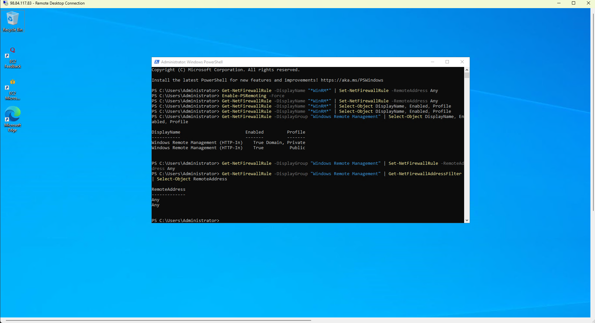
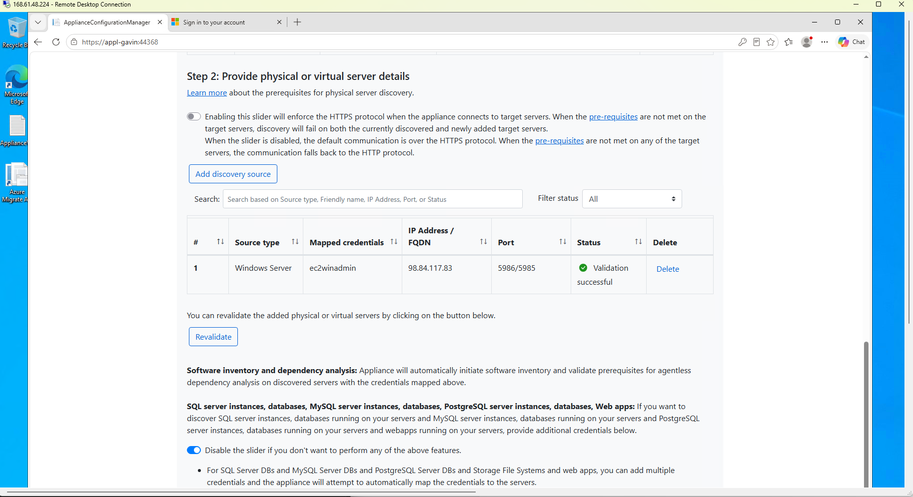

Click **Start discovery** (5–15 minutes).

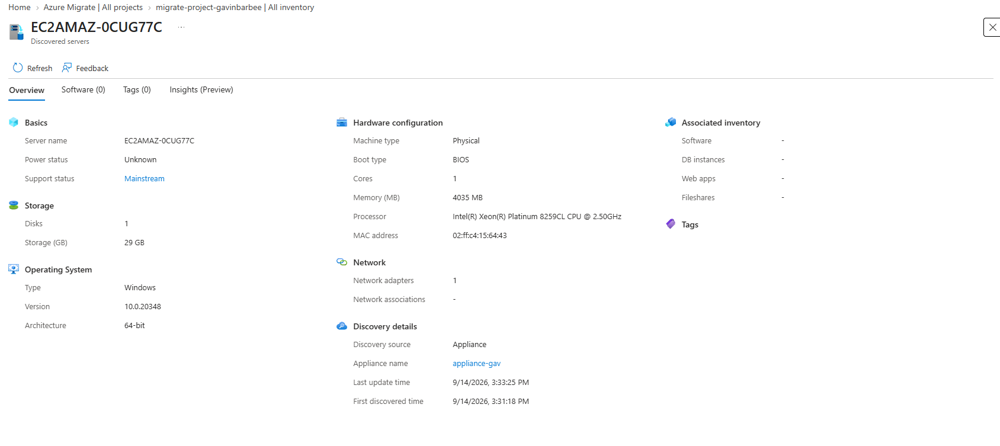
*The EC2 instance, fully discovered — OS, hardware, disks, all correctly identified across clouds.*

---

### Part 4 — Assess the EC2 Instance

#### Step 8: Create and review the assessment

1. Azure Migrate → your project → **Assess** → Assessment type **Azure VM**
2. Settings: Target location **East US**, Storage type **Automatic**, Sizing criteria **Performance-based**, Savings option **None**
3. Add workloads → select the EC2 instance → create the assessment (2–5 minutes)

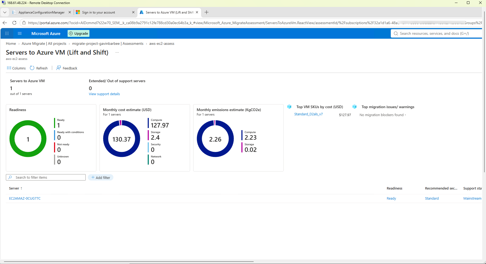

**Result:** Ready for Azure, recommended size `Standard_D2als_v7`, estimated monthly cost **$130.37**. This is the clean, successful conclusion of discovery and assessment — everything from here forward is the replication appliance story.

---

### Part 5 — Deploy the Replication Appliance

#### Step 9: Deploy the replication appliance VM at the correct spec

Current Microsoft documentation for this appliance specifies requirements well beyond what I'd originally planned for (`Standard_A4_v2`): **8 physical cores, 16GB+ RAM, 600GB+ disk**. For the `ads_v7` VM family (2 vCPUs per physical core via SMT), that means **`Standard_D16ads_v7`** — 16 vCPU / 64GB RAM — is the size that satisfies the physical-core check.

```hcl
resource "azurerm_windows_virtual_machine" "replication" {
  name                   = "vm-mig-repl-gavinbarbee"
  computer_name          = "repl-gavin"
  location               = var.location
  resource_group_name    = azurerm_resource_group.source.name
  size                   = "Standard_D16ads_v7"
  admin_username         = "replicationadmin"
  admin_password         = var.replication_admin_password
  network_interface_ids  = [azurerm_network_interface.replication.id]

  os_disk {
    caching              = "ReadWrite"
    storage_account_type = "Standard_LRS"
    disk_size_gb         = 700
  }

  source_image_reference {
    publisher = "MicrosoftWindowsServer"
    offer     = "WindowsServer"
    sku       = "2022-Datacenter-g2"
    version   = "latest"
  }

  tags = var.tags
}
```

The replication appliance's NSG also needs **TCP 9443** open inbound, in addition to 443 and 3389 — this is the "data transport" channel the EC2 instance uses to talk to the appliance, per Microsoft's current AWS-to-Azure migration documentation, and wasn't part of my original plan at all.

```hcl
security_rule {
  name                       = "allow-data-transport-inbound"
  priority                   = 1020
  direction                  = "Inbound"
  access                     = "Allow"
  protocol                   = "Tcp"
  source_port_range          = "*"
  destination_port_range     = "9443"
  source_address_prefix      = "*"
  destination_address_prefix = "*"
}
```

> **Reaching `Standard_D16ads_v7` requires 16 vCPU of quota in a single family** — this is where the lab ultimately stopped. See [How This Lab Ended](#-how-this-lab-ended) below before you deploy this size.

```bash
terraform apply
```

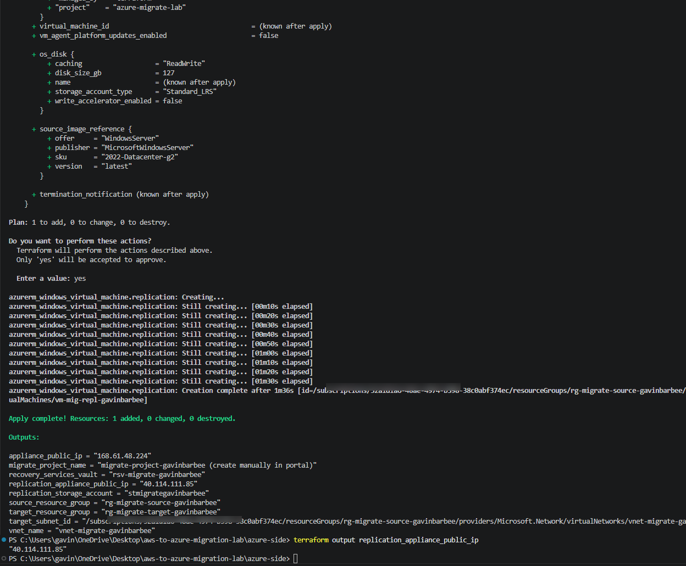
*An earlier, smaller successful deploy of this VM (127GB disk) — proving the deployment mechanics work before the sizing requirements were fully known. The final attempt used the 700GB/D16ads_v7 spec above.*

#### Step 10: Install the replication appliance

1. RDP into the replication VM
2. **Before running the installer:** Windows does not automatically extend the OS partition to fill a resized disk — run this first, every time this VM is rebuilt:
   ```powershell
   Resize-Partition -DriveLetter C -Size (Get-PartitionSupportedSize -DriveLetter C).SizeMax
   ```
3. Azure Migrate → **Execute** → **Migrations** → **Start execution** → *What do you want to migrate?* **Servers or virtual machines (VMs)** → *Where* **Azure VM** → *How will you select workloads?* **From replication appliance - Physical or other**
4. If no appliance is registered yet, click through to set one up: *Where do you want to migrate to?* **Azure**, target region **East US**
5. Download the installer under **Step 1: Create an appliance**, extract, run `.\DRInstaller.ps1` **from an already-open Administrator PowerShell window** (not "Run with PowerShell" — see Troubleshooting for why)

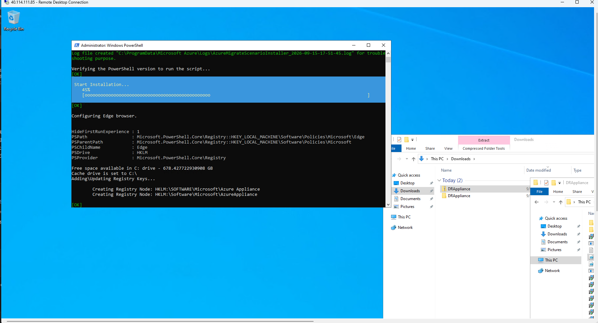
*678GB free after the partition fix — clearing the 600GB minimum.*

6. Generate a registration key under **Step 2**, paste it into the configuration manager that opens, and sign in via the **device code** flow (go to the URL shown, enter the code) — this sidesteps the interactive-redirect issues covered in Troubleshooting

7. Add credentials and the EC2 instance's public IP, same as Part 3's discovery credentials

This is as far as the lab was able to proceed. Continue to **How This Lab Ended** below.

---

### Part 6 — Test Migration and Cutover *(Not Reached)*

Neither step was reached in this run, since live replication never started — see [How This Lab Ended](#-how-this-lab-ended) below for the full, detailed sequence these steps would follow (enable replication → monitor to Protected → test migration → cutover → post-migration verification), reproduced in full for anyone completing this lab with sufficient quota.

---

## 🛑 How This Lab Ended

Discovery and assessment completed cleanly — the EC2 instance was found across clouds, evaluated, and correctly sized and costed by Azure Migrate. Getting the **replication appliance** running hit a real, well-documented wall, worth explaining in full because it's a genuinely realistic outcome for a migration project, not a mistake in execution.

**What happened, in order:**

1. The lab's original `Standard_A4_v2` size for the replication appliance is no longer available in most regions (capacity restrictions), and its documented requirements have grown since the lab was written.
2. Reaching a size that satisfied the *current* Microsoft-documented minimums (disk space, then memory, then CPU cores) required incrementally larger VM sizes — `Standard_D4alds_v7` → `Standard_D4ads_v7` → `Standard_D8ads_v7` → `Standard_D16ads_v7` — because the installer's CPU check counts **physical cores**, and the `ads_v7` family exposes 2 vCPUs per physical core, meaning the documented "8 cores" requirement actually means 16 vCPUs.
3. `Standard_D16ads_v7` requires 16 vCPUs of quota in a single VM family. This subscription's regional quota was capped at 4, then 10 after upgrading from Free Trial to Pay-As-You-Go (which unlocked self-service quota requests in the first place).
4. Requesting a further increase to 16 was submitted but not available for self-service approval on this subscription — Azure's quota system did not present a path to approve it without further escalation (e.g., a formal support ticket), which was outside the scope of what could be completed in this session.

**Why this is worth documenting rather than hiding:** insufficient compute quota is one of the most common real blockers in actual enterprise migrations — large organizations routinely have to file formal quota-increase support tickets with Microsoft before a migration project can proceed, sometimes waiting days for approval. Hitting this personally, and correctly diagnosing *why* (down to the exact vCPU family and the physical-vs-logical-core distinction in the installer's own validation check), is a more realistic demonstration of migration engineering than a clean, uninterrupted walkthrough would have been.

**What completing this migration would look like from here:**

1. **Resolve the quota block.** Submit a formal Azure support request for a quota increase (Subscriptions → Usage + quotas → Request increase, or via a support ticket if self-service isn't available) for at least 16 vCPUs in the `Dadsv7` family in the target region. In a real organization, this is typically requested days ahead of a migration's scheduled start, not discovered mid-project.

2. **Deploy the replication appliance at the correct spec** (Part 5, Step 9 above — `Standard_D16ads_v7`, 700GB disk) once quota allows it, then complete Step 10: run `DRInstaller.ps1`, register via device code sign-in, and add the AWS credentials and EC2 server details.

3. **Enable replication.** Back in the Azure portal: **Migration and modernization** → **Replicate** → *Are your machines virtualized?* **Yes, with another cloud provider (AWS, GCP, etc.)** → select the now-registered replication appliance → select the EC2 instance → **Target settings**: resource group `rg-migrate-target-gavinbarbee`, storage account `stmigrategavinbarbee`, VNet `vnet-migrate-gavinbarbee`, subnet `snet-migrate` → **Compute**: accept the recommended size (`Standard_D2als_v7`, per the completed assessment) → **Disks**: accept defaults → **Tags**: add `project = azure-migrate-lab` → click **Replicate**.

4. **Monitor initial replication.** The first full disk copy typically takes 20–60 minutes depending on disk size and network conditions — a 30GB Windows disk is usually 30–45 minutes. Watch **Replicating machines** in the portal; the status moves from *Initial replication in progress* to **Protected** once the full copy completes and the appliance is keeping up with ongoing delta syncs.

5. **Run a test migration before committing to anything production-facing.** Click the replicating machine → **Test migration** → select the target VNet. Azure spins up a temporary copy of the VM from the replicated disk in an isolated network (5–10 minutes). RDP into it, confirm the desktop loads, the hostname and OS version match the source, and anything workload-specific (installed software, file shares, services) came across intact. Then **Clean up test migration** to delete the temporary VM — this step doesn't affect the ongoing replication.

6. **Perform cutover.** Click the replicating machine → **Migrate**. For a real production workload, first shut down the source machine (prevents last-minute writes from being lost — *"split-brain"* — between the final sync and cutover); for a lab, skipping the shutdown is fine. Azure finalizes replication from the most recent synced state and creates the target VM in `rg-migrate-target-gavinbarbee` (5–10 minutes).

7. **Verify and cut over networking.** Attach a public IP to the new VM if needed (`az network public-ip create` + `az network nic ip-config update`, same pattern as attaching one to any Azure VM), RDP in with the original `Administrator` credentials, and confirm the hostname, OS version, and any installed applications match the source. Update DNS records, load balancer backend pools, or any hardcoded IP references — the migrated VM will have a new Azure IP address, not the original AWS one.

8. **Decommission the source.** Once the target VM is confirmed healthy and any cutover validation period has passed, the original EC2 instance can be stopped (kept briefly as a rollback option) and eventually terminated, and the AWS-side infrastructure (VPC, security group, IAM role/user) can be torn down.

This is the same sequence the lab's original instructions describe for Part 6 — reproduced here in full since it wasn't reached in this run, both for anyone replicating this lab with adequate quota and as a complete record of what the finished process looks like.

---

## 🛠️ Troubleshooting

Grouped by category — this is the real, complete list of what this lab actually surfaced, not just what I anticipated going in.

### AWS setup issues

| Issue | Cause | Resolution |
|---|---|---|
| `terraform apply` fails on every IAM resource with `AccessDenied` (role, policy, user) | `terraform-migrate-lab` only has `AmazonEC2FullAccess` and `AmazonVPCFullAccess` — but the lab's own Terraform also creates IAM resources, which neither policy covers | Attach `IAMFullAccess` to the user in IAM → Users → terraform-migrate-lab → Add permissions. Re-run `terraform apply` — it resumes from existing state, no resources are recreated. |
| `terraform apply` fails: *"invalid value for name (cannot begin with sg-)"* | AWS reserves the `sg-` prefix for system-generated security group IDs | Rename `aws_security_group.source_vm`'s `name` field to `migrate-source-sg-gavinbarbee` (this repo already uses the fixed name). |
| `terraform apply` fails: *"collecting instance settings: empty result"* | The `windows_ami` default is stale for your account/region — AMI IDs aren't permanent | Run: `aws ec2 describe-images --region us-east-1 --owners amazon --filters "Name=name,Values=Windows_Server-2022-English-Full-Base-*" "Name=state,Values=available" --query "sort_by(Images, &CreationDate)[-1].ImageId" --output text` and set the result in `terraform.tfvars`. |

### Azure infrastructure issues

| Issue | Cause | Resolution |
|---|---|---|
| `terraform apply` fails on the Recovery Services Vault: `BMSUserErrorDisablingSoftDeleteStateNotAllowed` | Azure made soft delete mandatory on new vaults, so my originally planned `soft_delete_enabled = false` is no longer a legal value | Set `soft_delete_enabled = true` in `azurerm_recovery_services_vault.main` (already fixed in this repo). |
| Re-running `apply` after the soft-delete fix errors: *"a resource with this ID already exists — needs to be imported"* | The first failed attempt actually created the vault in Azure before erroring, so it exists in Azure but not in Terraform's state | `terraform import azurerm_recovery_services_vault.main /subscriptions/<sub-id>/resourceGroups/rg-migrate-source-gavinbarbee/providers/Microsoft.RecoveryServices/vaults/rsv-migrate-gavinbarbee`, then `terraform apply` again. |

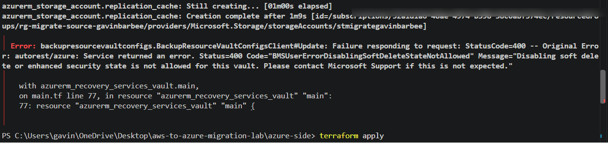
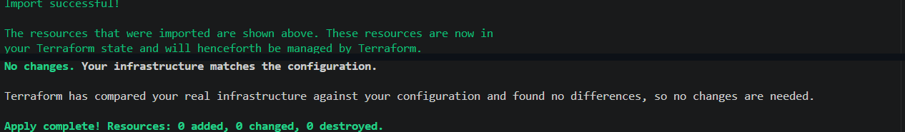

### Appliance VM sizing issues

| Issue | Cause | Resolution |
|---|---|---|
| `terraform apply` fails: *"unable to assume default computer name... at most 15 characters"* | Windows NetBIOS computer names cap at 15 characters; Azure defaults `computer_name` to the VM's `name`, which is longer | Set an explicit short `computer_name` (`appl-gavin`, `repl-gavin` — both under 13 characters). |
| `terraform apply` fails: *"disk size 80 GB is smaller than the size of the corresponding disk in the VM image: 127 GB"* | The Windows Server 2022 base image has grown since this lab was written | Set `disk_size_gb = 127` (or higher) on the OS disk. |
| `terraform apply` fails: *"exceeding approved Total Regional Cores quota"* | Free/low-tier Azure subscriptions default to a low regional vCPU cap (commonly 4) | Check `az vm list-usage --location eastus -o table`; free capacity by deallocating or deleting unused VMs (`az vm deallocate` or, if state drift becomes a problem, remove the resource from Terraform config and `apply` to destroy it cleanly rather than deleting via CLI directly). |
| `terraform apply` fails: *"SkuNotAvailable... Capacity Restrictions"* for `Standard_A4_v2`, then again for other sizes | Older VM generations are being phased out of regional capacity; availability changes over time and isn't fully predictable from quota alone | Query live capacity: `az vm list-skus --location eastus --resource-type virtualMachines --query "[?name=='<size>'].{Name:name, Restrictions:restrictions}" -o table`. `Standard_D4alds_v7` and later `Standard_Dxads_v7` sizes had availability when `A4_v2` and `D4s_v3` did not. |
| `terraform apply` fails: *"cannot boot Hypervisor Generation '1'"* | Some newer VM sizes only support Generation 2 images; the default Windows Server SKU string is Generation 1 | Use `sku = "2022-Datacenter-g2"` instead of `"2022-Datacenter"` in `source_image_reference`. |
| Appliance configuration manager: *"Memory and CPU validation failed... only 4 CPU cores, recommend 8"* — persists even after moving to an 8-vCPU size | The installer's check counts **physical cores**, not vCPUs. The `ads_v7` family exposes 2 vCPUs per physical core (confirmed via `Get-WmiObject -Class Win32_Processor`), so "8 cores" actually means **16 vCPUs**. | Deploy `Standard_D16ads_v7` (16 vCPU / 4→8 physical cores) — see [How This Lab Ended](#-how-this-lab-ended) for what happens next. |
| Appliance configuration manager: *"server has only 8GB memory, recommend 16GB"* | Original size was an `alds` (low-memory) variant | Switch to the equivalent non-`l` size (`D4alds_v7` → `D4ads_v7`) for double the RAM at the same vCPU count. |

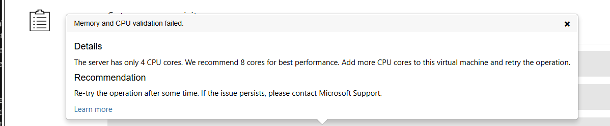
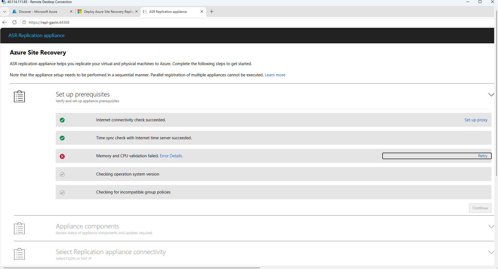
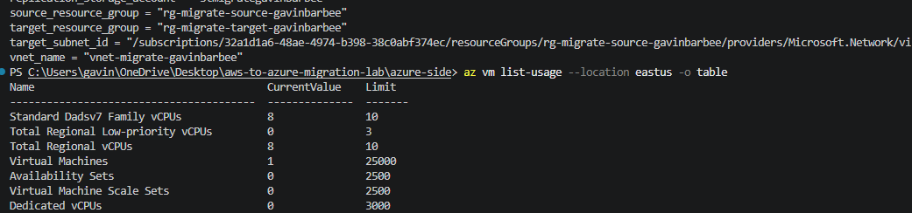

### Networking issues

| Issue | Cause | Resolution |
|---|---|---|
| Discovery source validation fails: *"WinRM cannot complete the operation... firewall exception for public profiles limits access to remote computers within the same local subnet"* | Two separate layers block this: (1) the AWS security group doesn't have port 5985 open, and (2) even with the port open, Windows' own WinRM firewall rule is scoped to the local subnet only, which excludes anything from Azure | **Layer 1:** add a `5985` ingress rule to the AWS security group and `terraform apply`. **Layer 2:** on the EC2 instance, run `Enable-PSRemoting -Force` (creates the WinRM firewall rules if they don't exist) then `Get-NetFirewallRule -DisplayGroup "Windows Remote Management" \| Set-NetFirewallRule -RemoteAddress Any` to widen the rule scope. Both are required — fixing only one still fails. |
| Replication appliance can't reach the EC2 instance for data transport | Port 9443 (the data-transport channel, separate from 443's control channel) isn't open on the replication appliance's NSG — not something I'd planned for going in | Add a `9443` inbound rule to `azurerm_network_security_group.replication` (already included in this repo). |


### Authentication issues

| Issue | Cause | Resolution |
|---|---|---|
| Appliance sign-in fails: *"Sorry, but we're having trouble signing you in. AADSTS900561: The endpoint only accepts POST requests. Received a GET request"* — persists across incognito windows, different accounts, cleared cookies | Not actually a browser/session issue. The real cause surfaces one layer deeper: signing in succeeds, but a follow-up authorization check fails with error code **530035**, which is a **Conditional Access / Security Defaults** block on a native client app (`Microsoft Azure PowerShell`), not a credentials problem | Go to [entra.microsoft.com](https://entra.microsoft.com) → Identity → Overview → Properties → Security defaults → **Disable**. Safe for a personal single-user lab tenant (the whole point of Security Defaults is protecting multiple users from credential-based attacks); re-enable after the lab if desired. Retry sign-in after a minute for the change to propagate. |


### Tooling and installer issues

| Issue | Cause | Resolution |
|---|---|---|
| `AzureMigrateInstaller.ps1` or `DRInstaller.ps1` opens and closes instantly with no visible error | Right-click "Run with PowerShell" closes the window immediately on any error, hiding the actual message | Run the script from an already-open Administrator PowerShell window instead: `cd` into the extracted folder, then `.\ScriptName.ps1` — errors stay on screen. |
| Installer script fails immediately, and `Get-ChildItem` shows the `.ps1` file at **0 bytes** | Corrupted/interrupted download | Delete the extracted folder and zip, re-download fresh, re-extract, and confirm the file size looks real before running. |
| DRInstaller aborts: *"This host has already been used as DR Appliance"* — even on a VM that never successfully registered | An earlier install attempt (in this case, an incorrectly-run discovery-appliance installer on what was meant to be the replication VM) left a marker file/registry state behind | Rebuild the VM from scratch (`terraform destroy -target="azurerm_windows_virtual_machine.replication"` then `terraform apply`) rather than trying to clean the marker manually — a fresh OS disk guarantees no conflict. |
| After a disk resize, DRInstaller still reports the old, smaller free space | Resizing the Azure managed disk resource does **not** automatically resize the NTFS partition inside Windows | Run `Resize-Partition -DriveLetter C -Size (Get-PartitionSupportedSize -DriveLetter C).SizeMax` manually after every disk-size change, before re-running the installer. |


### Architecture and product-change issues

| Issue | Cause | Resolution |
|---|---|---|
| After registering a second appliance, the portal shows the same "add credentials and discovery source" screen as the first (discovery) appliance, with no clear "replication" option | I'd originally planned around an older two-appliance UI flow (`AzureMigrateInstaller.ps1` for discovery, a distinct `DRInstaller.ps1` download for replication, each with its own dedicated setup screen). The current Azure Migrate portal has reorganized this, and it's easy to end up re-running the *discovery* installer on what was meant to be the *replication* VM. | Use **Execute → Migrations → Start execution → From replication appliance - Physical or other** in the current portal, which leads to a distinct "Step 1: Create an appliance" flow with its own `DRInstaller.ps1` download — this is the actual current path to the replication-specific installer, confirmed against [Microsoft's current documentation](https://learn.microsoft.com/en-us/azure/site-recovery/deploy-vmware-azure-replication-appliance-modernized). |
| Project key registration screen shows *"No replication appliance is registered to this project"* even after generating a key | The classic UI's linear appliance flow and the modernized UI's "Execute" flow are two different systems that don't always cross-reference cleanly | Click through the "Click here to set up" link rather than assuming the earlier-generated key/appliance covers this — it starts a fresh, correct setup flow for this specific appliance role. |

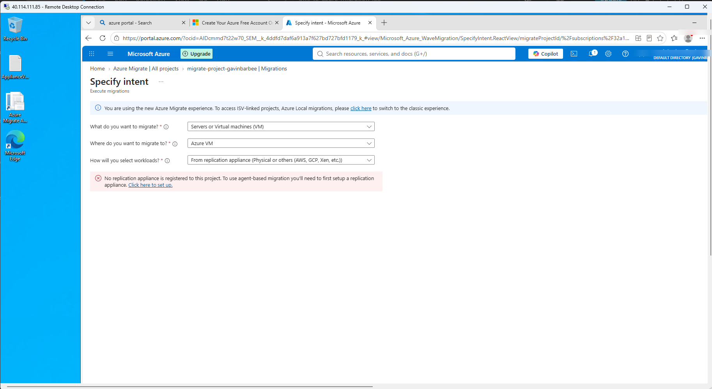


*Verifying the current process directly against Microsoft's docs rather than continuing to guess against a UI that had visibly changed.*

### Subscription-level issues

| Issue | Cause | Resolution |
|---|---|---|
| Quota increase request page won't accept a new request (no visible error, submission just doesn't go through) | Azure blocks **all** self-service quota increase requests on Free Trial subscriptions, regardless of the amount requested — a deliberate anti-abuse measure | Upgrade to Pay-As-You-Go (Cost Management + Billing → Upgrade). Existing free-trial credits still apply and are used first; upgrading doesn't forfeit them. This alone raised the default regional quota from 4 to 10 with no request needed. |
| Quota increase request to 16 vCPUs still not available for self-service after upgrading to Pay-As-You-Go | Some quota levels require manual review/support-ticket escalation rather than instant self-service approval, depending on account history and the size of the increase requested | Not resolved within this session — see [How This Lab Ended](#-how-this-lab-ended). In a real project, this is where a formal Azure support ticket would be filed. |

---

## 🧹 Cleanup

Destroy in this order to avoid dependency errors across the two clouds:

1. **Destroy AWS resources:**
   ```bash
   cd aws-side
   terraform destroy
   ```

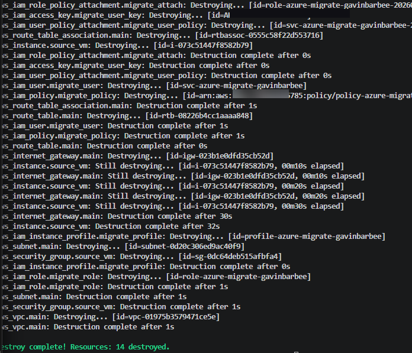

2. **Destroy Azure resources.** Because the Azure Migrate project (created manually in the portal, not by Terraform) generates several of its own resources inside `rg-migrate-source-gavinbarbee` — a Key Vault, dependency-mapping resources, discovery/assessment sites, a second Recovery Services Vault tied to the project — plain `terraform destroy` fails with *"the Resource Group still contains Resources."* Add this to the provider block in `azure-side/main.tf`:
   ```hcl
   provider "azurerm" {
     features {
       resource_group {
         prevent_deletion_if_contains_resources = false
       }
     }
   }
   ```
   Then:
   ```bash
   cd azure-side
   terraform destroy
   ```
   This deletes the resource group directly via the Azure API, sweeping up every portal-created resource inside it along with everything Terraform tracked.

3. **Verify** in both consoles that no resources remain, and double-check AWS Billing and Azure Cost Management for any lingering charges — especially confirm no VM sized `Standard_D16ads_v7` or similar is still running, given its cost relative to the rest of this lab.

---

## 💡 Key Takeaways

- **Discovery and assessment are a complete, valuable milestone on their own** — even without reaching replication, this lab produced a real cross-cloud inventory, a readiness determination, a right-sized VM recommendation, and a cost estimate. A migration project that stalls at this stage still delivered something real to a business.
- **"Agentless" describes the source machine, not the whole migration** — AWS-to-Azure migrations still require two dedicated appliance VMs in Azure (discovery and replication) even though nothing installs on the EC2 instance itself.
- **Infrastructure-as-code and portal-driven configuration are fundamentally different in what survives teardown.** Everything in this repo's `main.tf` files rebuilds perfectly with `terraform apply`. Everything the Azure Migrate *portal* created on top of that — the project, the discovery data, the appliance registrations — does not, and has to be redone by hand. Living through both halves of that distinction in one lab is a better lesson than reading about it.
- **Documented hardware requirements drift, and installers enforce the current numbers, not the ones you originally planned around** — disk size, memory, and CPU requirements for the replication appliance all turned out higher than expected. Checking a validation error's exact wording, and testing whether it's a hard block or just a recommendation, is worth doing before assuming a rebuild is required.
- **"8 cores" is not always what it sounds like.** The replication appliance's own installer counts physical cores, and modern Azure VM families expose 2 vCPUs per physical core via SMT — so a documented "8 core" minimum can mean provisioning a 16-vCPU VM. Confirming this with `Get-WmiObject -Class Win32_Processor` rather than assuming was the difference between guessing and knowing.
- **Subscription quota is a real, common blocker in professional migration work** — not a lab-only inconvenience. Free Trial subscriptions block self-service quota increases entirely; even Pay-As-You-Go accounts can hit levels that require a support ticket rather than instant approval. Planning quota headroom before a migration project starts is a real part of the job.
- **A two-layer fix is easy to half-solve.** The WinRM connectivity failure needed both the AWS security group *and* the Windows Firewall's rule scope fixed — patching only one produces an identical-looking failure, which can easily be mistaken for "the fix didn't work" rather than "half the fix is still missing."
- **When a product's current UI doesn't match a lab's screenshots, verify against current docs rather than keep guessing against the old flow** — re-running the same installer a second time under a wrong assumption cost real time; checking Microsoft's current documentation directly resolved it faster than continued trial and error would have.

---

**Author:** Gavin Barbee
**Lab Reference:** AWS EC2 to Azure Migration Using Azure Migrate
**Difficulty:** Intermediate (rated by the source lab) — realistically Advanced once accounting for current environment drift
**Time to Complete:** ~10 hours across two sessions (original estimate: 4–6 hours)